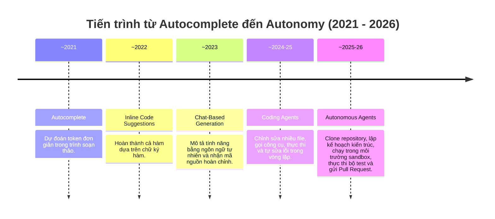
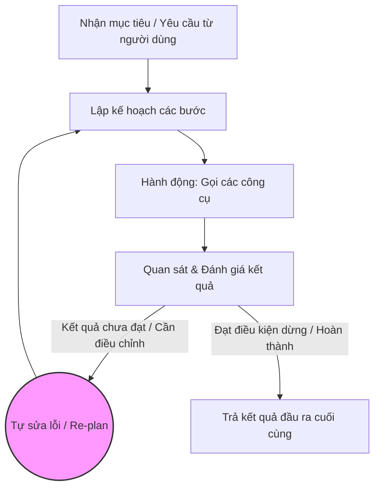
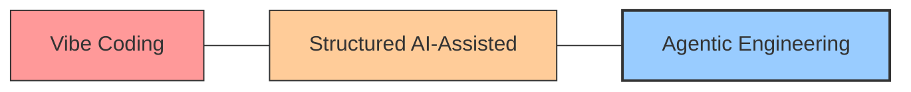
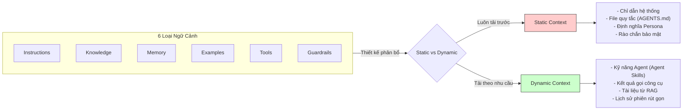
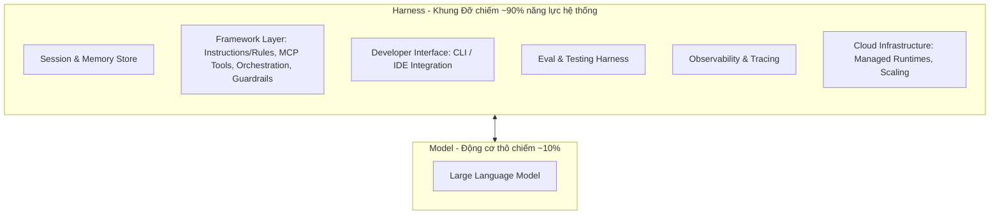
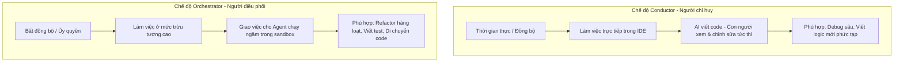
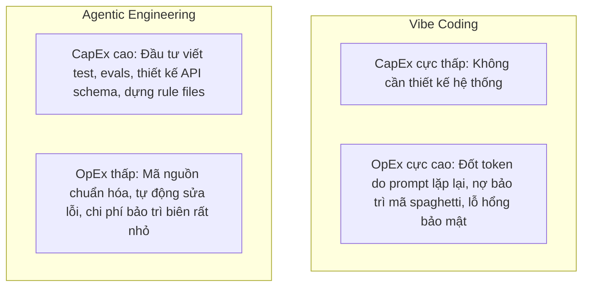

# Kỷ Nguyên SDLC Mới Với Vibe Coding: Từ Ad-hoc Prompting Đến Agentic Engineering

Tài liệu này tóm tắt các nội dung kiến thức trọng tâm từ tài liệu nghiên cứu của Google (May 2026): **"The New SDLC With Vibe Coding"** (tác giả: Addy Osmani, Shubham Saboo, và Sokratis Kartakis). 

---

## Mục lục
1. [Sự dịch chuyển từ Cú pháp sang Ý định (The Shift from Syntax to Intent)](#1-sự-dịch-chuyển-từ-cú-pháp-sang-ý-định-the-shift-from-syntax-to-intent)
2. [AI Agent: Kiến thức căn bản (AI Agents: A Quick Refresher)](#2-ai-agent-kiến-thức-căn-bản-ai-agents-a-quick-refresher)
3. [Vibe Coding là gì? (What is Vibe Coding?)](#3-vibe-coding-là-gì-what-is-vibe-coding)
4. [Phổ công nghệ: Vibe Coding đến Agentic Engineering](#4-phổ-công-nghệ-vibe-coding-đến-agentic-engineering)
5. [Kỹ nghệ Ngữ cảnh (Context Engineering: The Real Skill)](#5-kỹ-nghệ-ngữ-cảnh-context-engineering-the-real-skill)
6. [Vòng đời phát triển phần mềm mới (The New SDLC)](#6-vòng-đời-phát-triển-phần-mềm-mới-the-new-sdlc)
7. [Kỹ nghệ Khung đỡ (Harness Engineering)](#7-kỹ-nghệ-khung-đỡ-harness-engineering)
8. [Vai trò mới của Lập trình viên: Conductor & Orchestrator](#8-vai-trò-mới-của-lập-trình-viên-conductor--orchestrator)
9. [Coding Agent trong thực tế & Xây dựng Agent cho Production](#9-coding-agent-trong-thực-tế--xây-dựng-agent-cho-production)
10. [Kinh tế học trong phát triển AI (The Economics of AI Development)](#10-kinh-tế-học-trong-phát-triển-ai-the-economics-of-ai-development)
11. [Lộ trình bắt đầu (Where to Start)](#11-lộ-trình-bắt-đầu-where-to-start)
12. [Kết luận: Ý định là Giao diện mới (Intent as the new Interface)](#12-kết-luận-ý-định-là-giao-diện-mới-intent-as-the-new-interface)

---

## 1. Sự dịch chuyển từ Cú pháp sang Ý định (The Shift from Syntax to Intent)

Lịch sử ngành lập trình là quá trình con người làm công việc dịch thuật: hiểu bài toán của con người $\rightarrow$ thiết kế giải pháp trừu tượng $\rightarrow$ viết mã nguồn bằng cú pháp (syntax) máy tính hiểu. Mỗi bước đều tạo ra lực cản (friction). Sự xuất hiện của AI đang làm triệt tiêu lực cản này.

*   **Xu hướng cốt lõi:** Lập trình viên chuyển từ việc **viết mã nguồn (writing code)** sang **thể hiện ý định (expressing intent)** và tin tưởng các hệ thống thông minh dịch ý định đó thành phần mềm hoạt động.
*   **Thực tế năm 2026:**
    *   **85%** lập trình viên chuyên nghiệp thường xuyên sử dụng AI Coding Agents.
    *   **51%** sử dụng hàng ngày.
    *   **41%** lượng mã nguồn mới tạo ra là do AI sinh tự động.

### Hành trình tiến hóa từ Tự động hóa đến Tự trị (Figure 1)



*   **Nguyên lý dịch chuyển:** Càng tiến về sau, nỗ lực viết mã của con người (Human Effort) càng giảm, trong khi mức độ tự trị của máy (Machine Autonomy) càng tăng mạnh.

---

## 2. AI Agent: Kiến thức căn bản (AI Agents: A Quick Refresher)

Khác với một Chatbot (chỉ phản hồi khi có prompt và đợi lượt tiếp theo), một **AI Agent** là một hệ thống phần mềm tự vận hành một vòng lặp kín (Agent Loop) để đạt được mục tiêu đề ra.



### 5 thành phần cốt lõi của một Agent:
1.  **Model (Mô hình - Reasoning Engine):** Động cơ tư duy. Nó đọc ngữ cảnh hiện tại, quyết định hành động tiếp theo, suy nghĩ tiếp theo, hoặc lệnh gọi công cụ.
2.  **Tools (Công cụ):** Kết nối mô hình với thế giới bên ngoài (API, trình chạy mã sandbox, truy vấn cơ sở dữ liệu, hoặc ủy quyền cho agent khác).
3.  **Memory (Bộ nhớ):** Lưu giữ trạng thái (state). Cho phép agent nhớ lại các tương tác trước đó, truy xuất quy tắc cụ thể của dự án và không phải bắt đầu từ trang giấy trắng.
4.  **Orchestration (Điều phối):** Mã nguồn điều khiển vòng lặp. Nó chuẩn bị ngữ cảnh cho mỗi lần gọi model, điều phối các công cụ, ghi nhận kết quả và quyết định khi nào dừng lại.
5.  **Deployment (Triển khai):** Hạ tầng biến sản phẩm mẫu thành dịch vụ (hosting, định danh, khả năng giám sát - observability, bảo mật).

---

## 3. Vibe Coding là gì? (What is Vibe Coding?)

> [!NOTE]
> Khái niệm **Vibe Coding** được Andrej Karpathy đưa ra vào tháng 2/2025: Lập trình viên hoàn toàn nương theo cảm xúc ("vibes"), mô tả ý định bằng ngôn ngữ tự nhiên, chạy thử mã do AI sinh ra, và khi gặp lỗi thì sao chép nguyên văn thông báo lỗi dán lại cho AI tự sửa lỗi, không cần trực tiếp đọc hay hiểu mã nguồn.

Thuật ngữ này ban đầu mô tả luồng làm việc nhanh gọn khi dùng AI để tạo sản phẩm mẫu (prototyping). Tuy nhiên, đến đầu năm 2026, Karpathy nhận thấy khái niệm này dễ bị hiểu lầm và lạm dụng quá đà cho các dự án lớn, dẫn đến việc ông giới thiệu thuật ngữ **Agentic Engineering** để mô tả một cách tiếp cận có kỷ luật và tính hệ thống hơn.

---

## 4. Phổ công nghệ: Vibe Coding đến Agentic Engineering

Sự khác biệt cốt lõi giữa hai đầu của phổ công nghệ này không nằm ở việc *có dùng AI hay không*, mà nằm ở **mức độ cấu trúc, tính xác minh và sự phán đoán của con người bao quanh kết quả đầu ra của AI**.



### Bảng so sánh chi tiết các khía cạnh (Table 1 & Figure 3):

| Khía cạnh (Dimension) | Vibe Coding | Structured AI-Assisted Coding | Agentic Engineering |
| :--- | :--- | :--- | :--- |
| **Đặc tả ý định (Intent spec)** | Prompt ngôn ngữ tự nhiên thông thường | Prompt chi tiết kèm ví dụ và ràng buộc | Tài liệu đặc tả chính thức, sơ đồ kiến trúc, file bộ nhớ (`AGENTS.md`) |
| **Kiểm chứng (Verification)** | "Cảm thấy nó hoạt động" (Chạy thử thủ công) | Kiểm thử thủ công kết hợp kiểm tra ngẫu nhiên | Bộ test tự động (Automated tests), cổng CI/CD, hệ thống đánh giá bằng mô hình (LM judges) |
| **Hiểu mã nguồn (Codebase understanding)** | Tối thiểu; lập trình viên có thể không đọc/hiểu mã nguồn sinh ra | Đọc và đánh giá chọn lọc các luồng xử lý quan trọng | Đánh giá toàn diện kiến trúc; AI chỉ xử lý chi tiết triển khai bên dưới |
| **Xử lý lỗi (Error handling)** | Copy-paste nguyên văn lỗi ngược lại cho AI | Lập trình viên chẩn đoán nguyên nhân gốc, AI thực thi sửa lỗi | Agent tự chẩn đoán lỗi trong ranh giới; con người xử lý lỗi kiến trúc phức tạp |
| **Phạm vi phù hợp (Scope)** | Sản phẩm mẫu (Prototypes), scripts, dự án cá nhân, hackathons | Phát triển tính năng mới trong dự án hiện hữu | Hệ thống sản xuất quy mô lớn (Production), phát triển cấp độ đội nhóm |
| **Mức độ rủi ro (Risk profile)** | **Cao**. Phù hợp với mã nguồn dùng một lần rồi bỏ. | **Trung bình**. Con người giám sát tại các mốc quan trọng. | **Thấp**. Xác minh hệ thống chặt chẽ ở mọi giai đoạn. |

### Cách kiểm chứng kết quả trong Agentic Engineering
Để đạt được độ tin cậy trong môi trường sản xuất, Agentic Engineering sử dụng hai cơ chế song hành:
1.  **Tests (Kiểm thử):** Xác minh các phần có tính xác định (deterministic) của hệ thống (ví dụ: hàm nhận đầu vào $X$ phải trả về kết quả $Y$).
2.  **Evaluations (Evals - Đánh giá):** Xác minh các phần phi xác định (non-deterministic) của Agent (ví dụ: Agent có chọn đúng công cụ không, quỹ đạo giải quyết vấn đề có tối ưu không, phản hồi cuối cùng có bị ảo giác không). Evals được kiểm chứng qua bộ dữ liệu chuẩn có nhãn, bảng chấm điểm (rubrics) và các mô hình làm giám khảo (LM judges).

---

## 5. Kỹ nghệ Ngữ cảnh (Context Engineering: The Real Skill)

> [!IMPORTANT]
> **Chìa khóa cốt lõi:** Chất lượng mã nguồn do AI tạo ra phụ thuộc ít hơn vào độ khéo léo của prompt (Prompt Engineering) mà phụ thuộc trực tiếp vào **chất lượng và cấu trúc của ngữ cảnh (Context Engineering)** được cung cấp cho Agent.

### 6 Loại ngữ cảnh chính của Agent:
*   **Instructions (Chỉ dẫn):** Vai trò cốt lõi, mục tiêu và ranh giới hoạt động của Agent (ví dụ: `AGENTS.md`).
*   **Knowledge (Kiến thức):** Tài liệu đặc tả dự án, tài liệu API, sơ đồ kiến trúc và dữ liệu đặc thù.
*   **Memory (Bộ nhớ):** Nhật ký tương tác ngắn hạn và trạng thái dự án dài hạn.
*   **Examples (Ví dụ):** Các mẫu thiết kế mã nguồn chuẩn trong dự án (few-shot demonstrations).
*   **Tools (Công cụ):** Định nghĩa rõ ràng các API, câu lệnh shell, dịch vụ ngoài mà Agent có quyền gọi.
*   **Guardrails (Rào chắn):** Ràng buộc cứng, tiêu chuẩn định dạng và kiểm tra an toàn bảo mật.

### Phân tách Ngữ cảnh Tĩnh & Động (Figure 4)



*   **Agent Skills (Kỹ năng Agent):** Là các gói kiến thức quy trình có cấu trúc, giúp Agent hoạt động như một "tổng quát viên gọn nhẹ" (lightweight generalist) lúc khởi đầu, và chỉ nạp đầy đủ hướng dẫn chuyên môn (specialist role) khi phát hiện nhiệm vụ phù hợp. Điều này tối ưu hóa chi phí token và tránh hiện tượng nhiễu thông tin (context rot).

---

## 6. Vòng đời phát triển phần mềm mới (The New SDLC)

AI làm nén chu kỳ SDLC cực kỳ mạnh mẽ nhưng không đồng đều. Giai đoạn triển khai mã nguồn (Implementation) được rút ngắn từ tuần xuống giờ, nhưng khâu phân tích yêu cầu, thiết kế kiến trúc và kiểm chứng chất lượng vẫn cần tốc độ tư duy của con người.

### So sánh SDLC truyền thống và SDLC hướng AI (Figure 5)

```mermaid
gantt
    title SDLC Truyền Thống (Chu kỳ tính bằng Tuần)
    dateFormat  X
    axisFormat %d ngày
    section SDLC Truyền Thống
    Requirements & Planning :active, p1, 0, 3
    Design & Architecture   :p2, after p1, 2d
    Implementation          :p3, after p2, 15d
    Testing & QA            :p4, after p3, 5d
    Review & Deploy         :p5, after p4, 3d
    Maintenance             :p6, after p5, 5d
```

```mermaid
gantt
    title SDLC Hướng AI (Chu kỳ tính bằng Phút/Giờ)
    dateFormat  X
    axisFormat %H giờ
    section SDLC Hướng AI
    Requirements (Human Bottleneck) :active, a1, 0, 4h
    Design (Architecture Amplified) :a2, after a1, 2h
    Implementation (AI Agent Loop)  :crit, a3, after a2, 1h
    Testing (Auto Evals & QA)       :a4, after a3, 2h
    Review & Deploy (AI-assisted)   :a5, after a4, 1h
    Maintenance (Continuous Auto)   :a6, after a5, 2h
```





### Cách AI làm thay đổi từng giai đoạn:
*   **Requirements (Yêu cầu):** Chuyển từ tài liệu tĩnh sang một **cuộc hội thoại tương tác giữa người và AI** để đồng thời sinh ra tài liệu đặc tả và bản mẫu chạy thử (prototype) ngay lập tức.
*   **Design & Architecture (Thiết kế & Kiến trúc):** Vẫn do con người làm chủ vì liên quan đến việc đánh đổi (trade-offs). AI đóng vai trò áp đặt các quyết định kiến trúc đã chọn lên toàn bộ dự án một cách đồng nhất.
*   **Implementation (Triển khai):** Năng suất lập trình tăng từ **25% đến 39%**. Tuy nhiên, lập trình viên có thể tốn nhiều thời gian hơn để đọc hiểu, kiểm chứng và gỡ lỗi mã do AI sinh ra (METR ghi nhận lập trình viên có kinh nghiệm tốn thêm **19%** thời gian ở một số tác vụ phức tạp do khâu gỡ lỗi này).
*   **Testing & QA (Kiểm thử):** Tự động hóa sinh test cases, kiểm tra cả kết quả đầu ra (output evaluation) lẫn chuỗi hành động của agent (trajectory evaluation).
*   **Code Review & Deploy (Đánh giá & Triển khai):** AI làm bộ lọc vòng một (first-pass reviewer) để chỉ ra lỗi bảo mật, định dạng. CI/CD tự động phát hiện rủi ro và rollback tự động.
*   **Maintenance & Evolution (Bảo trì):** AI giúp đọc hiểu legacy code, chuyển đổi framework, cập nhật thư viện cũ và nâng cấp mã nguồn một cách nhanh chóng.

---

## 7. Kỹ nghệ Khung đỡ (Harness Engineering)

> [!IMPORTANT]
> Một mô hình ngôn ngữ lớn (LLM) đơn thuần không phải là một Agent. Nó chỉ trở thành Agent khi được bao bọc bởi một **Harness (Khung đỡ)**.
> $$\text{Agent} = \text{Model} + \text{Harness}$$

### Cấu trúc giải phẫu của một Agent (Harness Anatomy - Figure 7)



*   **Tầm quan trọng:** Các thử nghiệm thực tế (như trên *Terminal Bench 2.0*) chứng minh rằng chỉ cần tinh chỉnh các thành phần trong Harness (prompts, tools, middleware) mà không thay đổi mô hình LLM bên dưới đã giúp nâng thứ hạng của Agent từ ngoài Top 30 lên Top 5.
*   **Kết luận:** Hầu hết các lỗi của Agent trong thực tế là **lỗi cấu hình Harness** (thiếu công cụ, rào chắn lỏng lẻo, nhiễu ngữ cảnh) chứ không phải lỗi từ bản thân mô hình LLM.

---

## 8. Vai trò mới của Lập trình viên: Conductor & Orchestrator

Sự phân bổ công việc của lập trình viên được chuyển đổi thành hai vai trò linh hoạt:



### Vấn đề 80% (The 80% Problem)
*   **Thực trạng:** AI có thể tạo ra **80%** mã nguồn cho một tính năng cực kỳ nhanh chóng. Tuy nhiên, **20%** còn lại (bao gồm xử lý lỗi biên - edge cases, tích hợp hệ thống, bảo mật, tối ưu hiệu năng) lại đòi hỏi kiến thức sâu sắc về ngữ cảnh dự án mà AI thường thiếu.
*   **Giải pháp:** Lập trình viên xuất sắc phải dịch chuyển sự tập trung của mình từ khâu viết code đại trà sang khâu xử lý 20% phức tạp này và kiểm chứng tính đúng đắn của toàn bộ hệ thống.

---

## 9. Coding Agent trong thực tế & Xây dựng Agent cho Production

Coding Agent hiện diện tại 3 không gian làm việc chính của lập trình viên:
1.  **Trong IDE (Editor):** Đưa ra gợi ý inline, giải thích mã tại chỗ (ví dụ: Cursor, VS Code Copilot).
2.  **Trong Terminal:** Agent có quyền truy cập file system, chạy lệnh, chạy test và tự sửa lỗi (ví dụ: Claude Code, Antigravity CLI).
3.  **Chạy ngầm (Background):** Chạy độc lập trên cloud để xử lý các nhiệm vụ kéo dài hàng giờ và trả về Pull Request hoàn chỉnh (ví dụ: Google Jules).

### Công cụ xây dựng Agent của Google: Agents CLI & ADK
Khi lập trình viên cần xây dựng một Agent phục vụ người dùng cuối (ví dụ: Bot chăm sóc khách hàng, Agent tổng hợp báo cáo), quy trình xây dựng, đánh giá và triển khai được tích hợp trực tiếp thông qua **Google's Agents CLI**:

```bash
# Thiết lập một lần duy nhất
uvx google-agents-cli setup

# Ra lệnh trực tiếp cho Coding Agent của bạn:
> Build a support agent that answers questions from our docs.
> Evaluate it on the FAQ dataset.
> Deploy it to Agent Engine.
```

Hạ tầng sẽ tự động: Khởi tạo mẫu dự án $\rightarrow$ Viết mã ADK $\rightarrow$ Tạo bộ eval $\rightarrow$ Chạy thử nghiệm $\rightarrow$ Triển khai lên Agent Runtime $\rightarrow$ Cấu hình khả năng giám sát (Observability).

*   **Phối hợp đa Agent:** Thực hiện thông qua bộ lưu trữ trạng thái phiên chung, giao thức **Model Context Protocol (MCP)** để chia sẻ công cụ, và giao thức **Agent2Agent (A2A)** để ủy quyền công việc chéo giữa các Agent của các hãng khác nhau.

---

## 10. Kinh tế học trong phát triển AI (The Economics of AI Development)

Để tối ưu hóa chi phí khi áp dụng AI, doanh nghiệp cần hiểu rõ sự dịch chuyển giữa **CapEx** (Chi phí đầu tư ban đầu để xây dựng hệ thống) và **OpEx** (Chi phí vận hành và bảo trì liên tục).



### Đòn bẩy tài chính để tối ưu hóa OpEx:
*   **Context Engineering:** Chỉ gửi gói dữ liệu ngữ cảnh tinh gọn, mật độ thông tin cao thay vì gửi toàn bộ codebase 100,000 tokens cho mỗi lần prompt.
*   **Intelligent Model Routing (Định tuyến mô hình thông minh):** Sử dụng mô hình lớn, đắt tiền cho các tác vụ phức tạp (thiết kế kiến trúc, lên kế hoạch); tự động chuyển các tác vụ đơn giản hơn (viết test, định dạng mã, kiểm tra cú pháp) cho các mô hình nhỏ, nhanh và rẻ tiền hơn.

---

## 11. Lộ trình bắt đầu (Where to Start)

### A. Dành cho lập trình viên cá nhân:
1.  **Tạo file `AGENTS.md` (hoặc tương đương) cho dự án:** Ghi rõ stack công nghệ, quy ước viết code, luật cứng và quy trình làm việc. Bổ sung thêm quy tắc mới mỗi khi Agent làm sai để tránh lặp lại lỗi.
2.  **Cài đặt các bộ kỹ năng (như Agents CLI):** Để hỗ trợ đóng gói năng lực tự động.
3.  **Tự động hóa một quy trình lặp đi lặp lại:** Chọn một tác vụ nhỏ (ví dụ: sinh báo cáo tuần, review code tự động) để build Agent đầu tiên từ đầu đến cuối.
4.  **Viết test và evals trước khi tạo code:** Biến test và evals thành bản hợp đồng ràng buộc đối với Agent.
5.  **Duy trì kỹ năng nền tảng:** Luôn giữ tư duy thiết kế hệ thống, thuật toán và kỹ năng gỡ lỗi nâng cao sắc bén. Con người dùng AI để nhân bản năng lực, chứ không phải để thay thế hoàn toàn tư duy.

### B. Dành cho trưởng nhóm kỹ thuật (Engineering Leaders):
1.  **Coi Context Engineering là tài sản mã nguồn:** Quản lý file `AGENTS.md`, prompt hệ thống, thư viện skill như mã nguồn thực tế (cần review PR, quản lý phiên bản).
2.  **Định giá bằng kết quả Eval, không bằng Demo:** Bản demo chạy tốt một lần không chứng minh được gì. Chỉ có bộ Eval vượt qua kiểm thử diện rộng mới đủ điều kiện lên môi trường production.
3.  **Tái cấu trúc quy trình Code Review:** Huấn luyện đội ngũ cách phát hiện lỗi logic tinh vi, sự ảo giác thư viện và lỗ hổng bảo mật trong mã nguồn do AI tạo ra.

### C. Dành cho doanh nghiệp & tổ chức (Organizations):
1.  **Xem việc ứng dụng AI là khoản đầu tư kỹ thuật:** Đầu tư vào hạ tầng kiểm thử và bảo mật trước khi triển khai diện rộng để tránh tích tụ nợ kỹ thuật nhanh hơn khả năng trả.
2.  **Áp dụng tiêu chuẩn mở:** Sử dụng các giao thức tiêu chuẩn như MCP và A2A để tránh bị khóa chặt vào một nhà cung cấp mô hình (vendor lock-in).
3.  **Xây dựng đội nhóm lai (Hybrid Teams):** Thiết kế quy trình phối hợp rõ ràng giữa nhân sự con người và các Agent tự trị đóng vai trò như các thành viên trong nhóm.

---

## 12. Kết luận: Ý định là Giao diện mới (Intent as the new Interface)

*   **Bản chất của sự thay đổi:** Việc tạo ra mã nguồn (Generation) đã có máy móc lo liệu. Khả năng **xác minh (verification)**, **phán đoán (judgment)** và **định hướng (direction)** mới là những kỹ nghệ cốt lõi mới của người kỹ sư phần mềm.
*   **Hệ số nhân:** AI là một hệ số nhân năng lực (force multiplier) - nó sẽ phóng đại cả điểm mạnh lẫn điểm yếu trong văn hóa kỹ thuật sẵn có của doanh nghiệp bạn.
