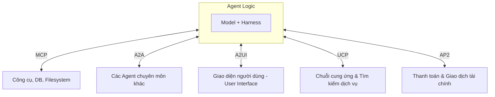
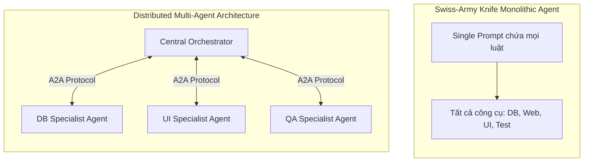
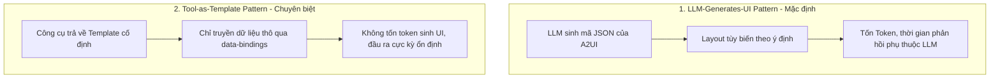
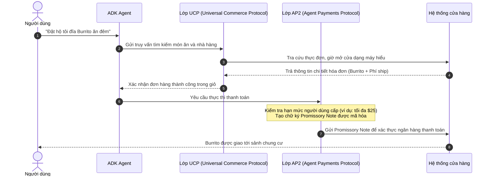

# Công Cụ Agent & Khả Năng Tương Thích (Agent Tools & Interoperability)

Tài liệu này tóm tắt các nội dung kiến thức trọng tâm từ tài liệu nghiên cứu của Google (May 2026): **"Agent Tools & Interoperability"** (tác giả: Kanchana Patlolla, Łukasz Olejniczak, và Pier Paolo Ippolito).

---

## Mục lục
1. [Giới thiệu: Sự tiến hóa của phần mềm hướng Agent](#1-giới-thiệu-sự-tiến-hóa-của-phần-mềm-hướng-agent)
2. [Giao thức Ngữ cảnh Mô hình (Model Context Protocol - MCP)](#2-giao-thức-ngữ-cảnh-mô-hình-model-context-protocol---mcp)
3. [Giải quyết bài toán tích hợp $N \times M$ (Bypassing the NxM Prototyping Problem)](#3-giải-quyết-bài-toán-tích-hợp-n-times-m-bypassing-the-nxm-prototyping-problem)
4. [Bộ công cụ & Quy tắc sử dụng MCP cho Vibe Coder](#4-bộ-công-cụ--quy-tắc-sử-dụng-mcp-cho-vibe-coder)
5. [Tương thích giữa các Agent (Agent-to-Agent - A2A Interoperability)](#5-tương-thích-giữa-các-agent-agent-to-agent---a2a-interoperability)
6. [Sự tiến hóa của Kiến trúc Agent: Monolith sang Microservices](#6-sự-tiến-hóa-của-kiến-trúc-agent-monolith-sang-microservices)
7. [Miền xác định vs. Miền bất định & Vấn đề lệnh nhảy GOTO](#7-miền-xác-định-vs-miền-bất-định--vấn-đề-lệnh-nhảy-goto)
8. [Xây dựng và Thương mại hóa Lực lượng lao động ảo (AaaS)](#8-xây-dựng-và-thương-mại-hóa-lực-lượng-lao-động-ảo-aaas)
9. [Tương thích giữa Agent và Giao diện (Agent-to-UI - A2UI Interoperability)](#9-tương-thích-giữa-agent-và-giao-diện-agent-to-ui---a2ui-interoperability)
10. [Hai mô hình sinh A2UI và Công cụ hỗ trợ](#10-hai-mô-hình-sinh-a2ui-và-công-cụ-hỗ-trợ)
11. [Agent và Thương mại điện tử (AP2 & UCP)](#11-agent-và-thương-mại-điện-tử-ap2--ucp)
12. [Kết luận](#12-kết-luận)

---

## 1. Giới thiệu: Sự tiến hóa của phần mềm hướng Agent

> [!NOTE]
> **Tuyên ngôn cốt lõi:** Bước tiến hóa tiếp theo của phần mềm không phải là được viết ra bằng mã nguồn (written), mà là được điều phối (orchestrated) bởi các Agent có khả năng tương thích chặt chẽ với nhau.

Nếu *Kỹ nghệ Agent (Agentic Engineering)* đại diện cho mặt bằng nhà máy chế tạo phần mềm, thì các giao thức **MCP, A2A, A2UI, AP2, và UCP** chính là các **Tiêu chuẩn Công nghiệp** (bu-lông, đai ốc, kích thước ren, định dạng dữ liệu và kênh truyền thông đồng bộ) giúp máy móc tương tác an toàn với thế giới bên ngoài.



### Các Giao thức Tiêu chuẩn trong Hệ sinh thái Agent:
*   **OpenResponses & Interactions API ("Phích cắm điện"):** Các API hiện đại hỗ trợ tác vụ dài hạn (long-running), làm mờ ranh giới giữa một lần gọi LLM phi trạng thái (stateless single turn) và một agent có trạng thái tuần tự.
*   **MCP (Model Context Protocol - "Cổng USB-C"):** Kết nối tức thì các mô hình với cơ sở dữ liệu, hệ thống tệp và các Web API ngoài.
*   **Skills ("Sách hướng dẫn"):** Các chỉ dẫn markdown và mã lệnh đơn giản chạy trong môi trường sandbox như terminal.
*   **A2A (Agent-to-Agent - "Bộ đàm nhà máy"):** Cho phép các agent chuyên môn hóa thương lượng, thảo luận nhóm và ủy quyền chéo công việc.
*   **A2UI (Agent-to-User Interface - "Cửa sổ trưng bày sinh động"):** Chuyển đổi các cấu trúc JSON phức tạp từ Agent thành các thành phần trực quan, tương tác an toàn với người dùng.
*   **AP2 & UCP ("Chuỗi cung ứng và Mạng lưới giao dịch toàn cầu"):** Cho phép các Agent tự thương lượng và thực hiện các giao dịch thương mại có tính chất tài chính.

---

## 2. Giao thức Ngữ cảnh Mô hình (Model Context Protocol - MCP)

Cách tiếp cận truyền thống để tích hợp công cụ vào LLM là **bespoke hardwiring** (nối dây thủ công bằng các REST API wrapper tự viết, cấu hình khóa API riêng lẻ và viết parser JSON thủ công). MCP thay thế sự phức tạp này bằng một **ổ cắm chuẩn hóa (standardized socket)**.

Quy trình tích hợp một MCP Server vào Coding Agent gồm 3 bước:
1.  **Discovery (Khám phá):** Tìm kiếm các MCP server đã được xây dựng sẵn từ 3 nguồn:
    *   *Public MCP Registries:* Các kho đăng ký công khai (ví dụ: `registry.modelcontextprotocol.io`, GitHub). Tiện lợi cho làm prototype nhanh nhưng chưa được kiểm duyệt kỹ.
    *   *Third-Party (3P) Remote MCP Servers:* Các đầu mút (endpoints) chính thức do các bên lớn vận hành (Google Maps, BigQuery, Google Docs) đảm bảo an toàn.
    *   *Internal Registries:* Kho nội bộ của doanh nghiệp (quản lý qua GCP Agent Registry hoặc API gateway).
2.  **Configuration (Cấu hình):** Khai báo phạm vi quyền hạn (scopes) và các biến môi trường để xác thực (API Key, OAuth tokens).
3.  **Connection (Kết nối):** Thực hiện bắt tay (handshake) để liệt kê danh sách công cụ và kiểm chứng schema đầu ra.

---

## 3. Giải quyết bài toán tích hợp $N \times M$ (Bypassing the NxM Prototyping Problem)

Khi thử nghiệm $N$ mô hình LLM khác nhau với $M$ công cụ ngoài khác nhau:
*   **Không có giao thức chung:** Lập trình viên phải viết và bảo trì $O(N \times M)$ điểm kết nối thủ công. Chỉ cần 1 API công cụ thay đổi, hàng loạt parser sẽ bị vỡ.
*   **Có giao thức MCP:** Độ phức tạp giảm xuống dạng tuyến tính $O(N + M)$ nhờ lớp trung gian chuẩn hóa.

```mermaid
graph LR
    subgraph NoMCP [Tích hợp truyền thống: O(N x M)]
        direction TB
        M1[Model A] --> T1[Tool 1]
        M1 --> T2[Tool 2]
        M2[Model B] --> T1
        M2 --> T2
    end
    
    subgraph WithMCP [Tích hợp qua MCP: O(N + M)]
        direction TB
        m1[Model A] --> MCP[Lớp MCP chung]
        m2[Model B] --> MCP
        MCP --> t1[Tool 1]
        MCP --> t2[Tool 2]
    end
```

### Các cơ chế vận chuyển gói tin (Transport Layer) của MCP:
*   **stdio (Standard Input/Output):** Phổ biến nhất trong môi trường local và làm prototype. Client khởi chạy MCP server như một tiến trình con chạy ngầm (subprocess), trao đổi thông điệp dạng `JSON-RPC 2.0` qua luồng nhập/xuất chuẩn.
*   **SSE (Server-Sent Events) over HTTP:** Dành cho các agent chạy thực tế trên cloud. Host client kết nối đến một MCP endpoint từ xa và nhận dữ liệu stream thời gian thực.

---

## 4. Bộ công cụ & Quy tắc sử dụng MCP cho Vibe Coder

### Các công cụ gỡ lỗi (Debugging Tools):
*   **MCP Inspector:** Công cụ giao diện web cục bộ của nhà phát triển, cho phép truy vấn thử các MCP server, xem cấu trúc schema của công cụ, test thủ công dữ liệu đầu vào và xem trực tiếp các gói tin JSON-RPC 2.0 mà không cần chạy toàn bộ Agent workflow.
*   **Chrome DevTools:** Dùng để giám sát các luồng dữ liệu truyền tải theo thời gian thực đối với các kết nối SSE từ xa.

### Các nguyên tắc vàng (Do's & Don'ts) khi sử dụng MCP:
> [!IMPORTANT]
> **NÊN LÀM (Do's):**
> *   Kiểm duyệt mã nguồn của các public server trước khi kết nối nếu Agent có quyền truy cập vào file hệ thống hoặc thông tin nhạy cảm của bạn.
> *   Sử dụng cơ chế RAG cho công cụ (chỉ tải động các công cụ cần thiết vào context window và giải phóng chúng sau khi xong việc để tránh hiện tượng loãng sự chú ý của mô hình).
> *   Đặt cơ chế có sự tham gia của con người (HITL - Human-in-the-loop) để phê duyệt trước khi gọi công cụ ngoài nhằm ngăn chặn rò rỉ dữ liệu.
> *   Sử dụng MCP Inspector để gỡ lỗi thay vì sửa prompt mù quáng khi Agent bị lỗi gọi công cụ.

> [!WARNING]
> **KHÔNG ĐƯỢC LÀM (Don'ts):**
> *   Không tự viết custom REST wrapper nếu đã có sẵn MCP Server tương ứng ngoài thị trường.
> *   Không đưa các public MCP server chưa kiểm duyệt vào sản phẩm chạy thực tế (Production).
> *   Không viết cứng (hardcode) thông tin xác thực (API key, tokens) vào file code hoặc prompt; hãy dùng biến môi trường.
> *   Không cấp quyền truy cập rộng rãi cho MCP Server vào tất cả các dự án; hãy giới hạn phạm vi (scope) cụ thể cho từng thư mục làm việc.

---

## 5. Tương thích giữa các Agent (Agent-to-Agent - A2A Interoperability)

Khi hệ thống dịch chuyển từ một Agent đơn lẻ sang **mạng lưới các chuyên gia chuyên môn hóa phân tán**, giao thức **A2A** đóng vai trò là ngôn ngữ chung giúp các agent phát hiện, kết nối và phối hợp làm việc độc lập với ngôn ngữ lập trình, hạ tầng chạy hay framework của từng agent riêng lẻ.

---

## 6. Sự tiến hóa của Kiến trúc Agent: Monolith sang Microservices

Quá trình phát triển kiến trúc Agent đang lặp lại lịch sử ngành phần mềm: chuyển từ một khối duy nhất (Monolith) sang các dịch vụ siêu nhỏ (Microservices).



### Tại sao Single Agent Monolith (Agent đơn khối) lại thất bại?
1.  **Scaling Friction (Lực cản khi mở rộng):** Việc cố gắng tối ưu prompt cho tác vụ database trong cùng một prompt với logic UI sẽ làm chúng gây nhiễu lẫn nhau. Đồng thời, cấp quá nhiều công cụ cho một mô hình sẽ mở rộng không gian tìm kiếm (search space), làm tăng tỷ lệ ảo giác và chọn sai công cụ.
2.  **Contextual Overload (Quá tải ngữ cảnh):** Nhét tất cả chỉ dẫn hệ thống, cấu trúc schema của hàng chục công cụ và lịch sử trò chuyện dài hạn vào một prompt duy nhất sẽ nhanh chóng làm tràn bộ nhớ làm việc của LLM.
3.  **Single Point of Failure (Điểm lỗi đơn nhất):** Chỉ cần một lỗi nhỏ trong một công cụ hoặc chỉ dẫn có thể khiến toàn bộ hệ thống bị treo hoặc mất khả năng suy luận.

*   **Giải pháp:** Phân rã logic (Logical Partitioning) thành các sub-agent chuyên trách có prompt tối giản và tập công cụ giới hạn. Chúng chia sẻ chung runtime/bộ nhớ ở mức độ nội bộ, hoặc tương tác xuyên biên giới mạng thông qua giao thức **A2A**.

---

## 7. Miền xác định vs. Miền bất định & Vấn đề lệnh nhảy GOTO

| Đặc tính | Miền xác định (Bounded Domains) | Miền bất định (Unbounded Domains) |
| :--- | :--- | :--- |
| **Đối tượng áp dụng** | Công cụ thông thường / REST API | Agent cộng tác (Collaborative Agent) |
| **Cơ chế hoạt động** | Fire-and-forget (Bắn và quên) | Tương tác đa luồng, đàm phán nhiều lượt |
| **Độ ổn định dữ liệu** | Dữ liệu đầu vào hoàn hảo, cấu trúc chuẩn hóa | Dữ liệu mập mờ, yêu cầu xung đột, sai lệch |

### Vấn đề lệnh nhảy GOTO trong Kiến trúc Agent (The GOTO Problem)
If cố tình ép buộc một Agent tự trị (hoạt động trong miền bất định) vào một wrapper công cụ thông thường (miền xác định), bạn sẽ tạo ra một lỗi kiến trúc tương tự như **lệnh nhảy GOTO** vô chính phủ:
*   Luồng điều khiển của Orchestrator bị ngắt quãng do Agent trung gian có thể dừng lại để hỏi thêm thông tin từ người dùng, rơi vào trạng thái chờ hoặc không bao giờ trả kết quả về nếu người dùng hủy phiên làm việc.
*   **Giải pháp từ A2A:** Giao thức A2A cách ly trạng thái tương tác nhiều lượt phức tạp này ở tầng phối hợp A2A, giữ cho tầng công cụ (MCP) luôn sạch sẽ, dự đoán được và có cấu trúc chặt chẽ.

---

## 8. Xây dựng và Thương mại hóa Lực lượng lao động ảo (AaaS)

A2A mở ra mô hình kinh doanh phần mềm mới: **Agent-as-a-Service (AaaS)**.

*   **Agent Card:** Tấm danh thiếp định danh của Agent (giống như CV chạy bằng máy). Nó chứa:
    *   *Capabilities (Năng lực):* Các tác vụ Agent có thể đảm nhận.
    *   *Security & Compliance (Bảo mật & Tuân thủ):* Quy định bảo mật dữ liệu và quyền truy cập.
    *   *Interaction Schemas (Sơ đồ tương tác):* Sơ đồ giao tiếp qua A2A.
*   **Monetization (Kiếm tiền):** Các nhà phát triển có thể niêm yết các Agent của mình lên Google Cloud Marketplace để tiếp cận các khách hàng doanh nghiệp sử dụng *Gemini Enterprise*.
*   **Thanh toán vi mô không cần định danh (x402/L402 Standard):** Dựa trên A2A Extensions, server của Agent có thể chặn yêu cầu chưa thanh toán và trả về mã lỗi `HTTP 402 Payment Required` kèm hóa đơn. Agent gọi sẽ tự động thanh toán bằng mã token mã hóa trước khi thử lại tác vụ.

---

## 9. Tương thích giữa Agent và Giao diện (Agent-to-UI - A2UI Interoperability)

Các Agent hiện tại thường trả về kết quả thô dạng JSON khiến người dùng gặp khó khăn trong việc đọc hiểu. Chúng cần một giao diện trực quan để giao tiếp hiệu quả hơn với con người.

> [!NOTE]
> **Generative UI (Giao diện sinh tự động):** Là khái niệm LLM tạo ra giao diện người dùng động trong thời gian thực dựa trên ý định và ngữ cảnh của người dùng, thay vì lập trình viên phải viết sẵn cứng (hardcode) tất cả các trạng thái giao diện có thể có.

### A2UI: Giải pháp thực thi an toàn của Google
Nếu hiển thị trực tiếp mã nguồn giao diện (ví dụ: mã React, JS) do LLM tạo ra sẽ tiềm ẩn các rủi ro bảo mật nghiêm trọng như tấn công chèn mã độc (code injection, XSS).

**A2UI giải quyết điều này bằng cách phân tách vai trò:**
*   A2UI đóng vai trò như **bản nhạc (sheet music)** ghi chép ý định hiển thị dưới dạng khai báo trung lập (declarative format).
*   Agent chỉ quyết định hiển thị các component nào từ một danh mục được tin tưởng sẵn (**Trusted Catalog** - ví dụ như Card, Button, Tabs).
*   Trình hiển thị phía Client (React, Flutter, SwiftUI, v.v.) đóng vai trò là **nhạc cụ**, trực tiếp đọc bản nhạc A2UI và tự vẽ các component tương ứng lên thiết bị của người dùng một cách an toàn.

---

## 10. Hai mô hình sinh A2UI và Công cụ hỗ trợ

### Bảng so sánh 2 mô hình tạo dựng giao diện (Generating A2UI):



### Bộ danh mục Component cơ bản của A2UI (v0.9):
A2UI đi kèm 18 component cơ bản hỗ trợ tạo prototype nhanh:
*   **Layout (Bố cục):** Row, Column, List
*   **Display (Hiển thị):** Text, Image, Icon, Divider
*   **Containers (Chứa đựng):** Card, Modal, Tabs
*   **Media (Phương tiện):** Video, AudioPlayer
*   **Interactive (Tương tác):** Button, TextField, CheckBox, Slider, DateTimeInput, ChoicePicker

### Canvas + A2UI: Không gian làm việc tương tác thời gian thực
Khác với giao diện chat tuyến tính tĩnh, **Canvas** kết hợp với **A2UI** tạo ra một tài liệu sống (living document). Cả người dùng và Agent đều có thể chỉnh sửa trực tiếp trên tài liệu này, Agent sẽ quan sát hành động của người dùng trên giao diện để đưa ra các xử lý tương ứng tiếp theo.

---

## 11. Agent và Thương mại điện tử (AP2 & UCP)

Khi Agent chuyển từ nhiệm vụ "Đọc" (MCP, A2A, A2UI) sang thực thi các **hành động (Actions) có ảnh hưởng tài chính thực tế**, chúng cần các giao thức thương mại bảo mật cao.



### Phân vai giữa UCP và AP2:
*   **UCP (Universal Commerce Protocol):** Đóng vai trò là **Bộ não mua sắm**. Nó giao tiếp với cửa hàng, duyệt menu, chọn món, xử lý tùy biến và đưa hàng vào giỏ.
*   **AP2 (Agent Payments Protocol):** Đóng vai trò là **Ví tiền an toàn**. Nó chịu trách nhiệm thanh toán mà không làm rò rỉ thông tin thẻ tín dụng của người dùng.
    *   *Mandate (Rào chắn hạn mức):* Cài đặt giới hạn cứng (Ví dụ: "Chỉ được tiêu tối đa $25 tại Taco Bell").
    *   *Handshake (Bắt tay bảo mật):* Không truyền số thẻ trực tiếp, chỉ gửi một "kế ước hứa trả" (promissory note) đã ký mã hóa bởi người dùng để ngân hàng của cửa hàng tự đối soát.
    *   *No Hidden Fees (Chống phí ẩn):* Nếu cửa hàng cố tình thu $50 thay vì hạn mức $18.50 đã ký duyệt, AP2 sẽ chặn giao dịch ngay lập tức.

---

## 12. Kết luận

Bằng cách áp dụng các giao thức mở tiêu chuẩn công nghiệp:
1.  **MCP** giải phóng lập trình viên khỏi việc viết wrapper API kết nối công cụ.
2.  **A2A** giải quyết sự phân mảnh, giúp các agent chuyên môn hóa phối hợp tạo ra đội ngũ lao động số.
3.  **A2UI** giúp thu hẹp khoảng cách giao tiếp trực quan giữa người và máy một cách an toàn.
4.  **AP2 và UCP** mở đường cho nền kinh tế thương mại tự trị của Agent.

Sự kết hợp này giúp chuyển đổi các nhà phát triển từ những thợ sửa ống nước kỹ thuật (chuyên nối dây các REST API mỏng manh) trở thành các **kiến trúc sư trưởng** điều phối toàn bộ lực lượng lao động tự trị toàn cầu.
