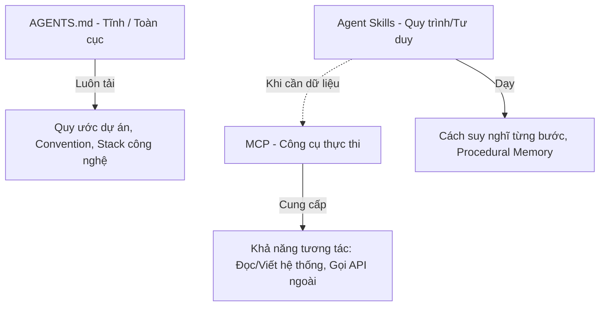
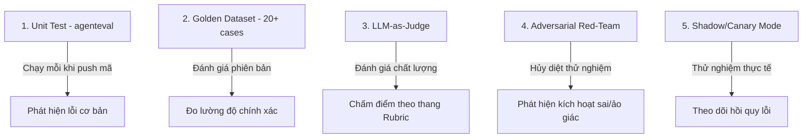
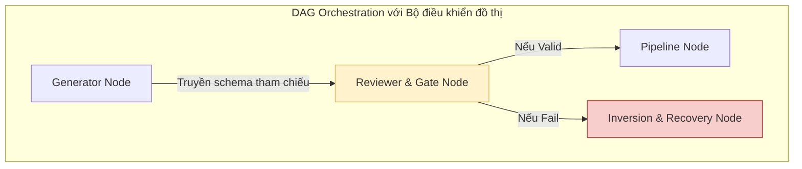

# Kỹ Năng Agent (Agent Skills)

Tài liệu này tóm tắt các nội dung kiến thức trọng tâm từ tài liệu nghiên cứu của Google (May 2026): **"Agent Skills"** (tác giả: Tanvi Singhal, Gabriela Hernandez Larios, Debanshu Dus, Lavi Nigam, và Smitha Kolan).

---

## Mục lục
1. [Giới thiệu: Kỹ năng Agent là gì?](#1-giới-thiệu-kỹ-năng-agent-là-gì)
2. [Cấu trúc giải phẫu của một Skill & Cơ chế nạp tiệm tiến (Progressive Disclosure)](#2-cấu-trúc-giải-phẫu-của-một-skill--cơ-cơ-chế-nạp-tiệm-tiến-progressive-disclosure)
3. [Đặc tả YAML Frontmatter - Thuật toán định tuyến](#3-đặc-tả-yaml-frontmatter---thuật-toán-định-tuyến)
4. [So sánh: Skill vs. MCP vs. AGENTS.md](#4-so-sánh-skill-vs-mcp-vs-agentsmd)
5. [Tại sao Agent Skills trở nên phổ biến nhanh chóng?](#5-tại-sao-agent-skills-trở-nên-phổ-biến-nhanh-chóng)
6. [Đánh giá Kỹ năng (Evaluating Skills)](#6-đánh-giá-kỹ-năng-evaluating-skills)
7. [Chất lượng đầu ra và Quỹ đạo công cụ (Tool Trajectory)](#7-chất-lượng-đầu-ra-và-quỹ-đạo-công-cụ-tool-trajectory)
8. [Từ Prototype lên Production: Ranh giới thực tế](#8-từ-prototype-lên-production-ranh-giới-thực-tế)
9. [Hiện tượng thối rữa ngữ cảnh (Context Rot & Lost in the Middle)](#9-hiện-tượng-thối-rữa-ngữ-cảnh-context-rot--lost-in-the-middle)
10. [Meta-Skills & Kỹ năng tự cải tiến (Self-Improving Skills)](#10-meta-skills--kỹ-năng-tự-cải-tiến-self-improving-skills)
11. [Điều phối và Đóng gói kỹ năng (Composing & Packaging Skills)](#11-điều-phối-và-đóng-gói-kỹ-năng-composing--packaging-skills)
12. [Lựa chọn và Quản trị thư viện Skill](#12-lựa-chọn-và-quản-trị-thư-viện-skill)
13. [Kết luận & Lộ trình thực hiện](#13-kết-luận--lộ-trình-thực-hiện)

---

## 1. Giới thiệu: Kỹ năng Agent là gì?

> [!NOTE]
> **Định nghĩa cốt lõi:** **Agent Skill** là một thư mục có cấu trúc đóng vai trò là một đơn vị năng lực độc lập, di động và nhẹ, giúp biến đổi một Agent đa năng (general-purpose) thành một chuyên gia chuyên biệt khi có yêu cầu, tránh hiện tượng quá tải prompt hệ thống.

Cấu trúc thư mục của một Skill chứa file đặc tả bắt buộc `SKILL.md` cùng các thư mục tùy chọn `scripts/` (chứa mã thực thi), `references/` (tài liệu tham chiếu) và `assets/` (các tài nguyên đầu ra).

### 4 điểm nghẽn lớn trong phát triển AI Agent được giải quyết bởi Skills:
1.  **Quá tải hướng dẫn (Context Rot):** Việc nhét tất cả các chỉ dẫn vào một prompt hệ thống duy nhất sẽ làm giảm nghiêm trọng hiệu năng suy luận của LLM. Skills giải quyết việc này bằng cách **chỉ nạp theo yêu cầu (loading on demand)**.
2.  **Thiếu bộ nhớ quy trình (Procedural Memory):** LLM hiện tại đã có bộ nhớ sự kiện (episodic) và bộ nhớ ngữ nghĩa (semantic), nhưng thiếu khả năng ghi nhớ các bước thực hiện quy trình từng bước. Skills cung cấp **nguyên mẫu bộ nhớ quy trình (procedural memory primitive)** đầu tiên cho Agent.
3.  **Quá tải cấu trúc đa Agent (Multi-agent overload):** Các hệ thống đa Agent rất khó duy trì và vận hành. Skills giúp một Agent duy nhất có thể linh hoạt đóng nhiều vai trò chuyên gia khác nhau một cách mượt mà.
4.  **Tính di động (Portability):** Cấu trúc tệp Markdown đơn giản giúp Skills dễ dàng chia sẻ và hoạt động tương thích trên nhiều nền tảng AI khác nhau.

---

## 2. Cấu trúc giải phẫu của một Skill & Cơ chế nạp tiệm tiến (Progressive Disclosure)

Cơ chế **nạp tiệm tiến (progressive disclosure)** giúp giảm thiểu tối đa chi phí token bằng cách tải thông tin theo 3 cấp độ:
1.  **Metadata (Tên + Mô tả):** Luôn được tải sẵn trong ngữ cảnh của Agent để làm căn cứ định tuyến nhiệm vụ (~30 đến 80 tokens cho mỗi skill).
2.  **SKILL.md Body (Chi tiết chỉ dẫn):** Chỉ được tải khi Agent quyết định kích hoạt (trigger) skill đó.
3.  **Bundled Resources (scripts, references):** Chỉ nạp hoặc thực thi khi phần thân của skill trực tiếp tham chiếu tới.

### Sơ đồ cấu trúc thư mục chuẩn (Snippet 1):
```text
cafe-preparation/
├── SKILL.md                  # Bắt buộc: Chứa metadata (YAML) và chỉ dẫn chi tiết (markdown)
├── scripts/                  # Tùy chọn: Mã code thực thi (Python, Bash...) để tính toán/định dạng
│   ├── calc_quantities.py
│   └── convert_to_ingredients.py
├── references/               # Tùy chọn: Tài liệu ngữ cảnh phụ trợ (công thức, quy tắc biên...)
│   ├── menu_and_recipes.md
│   └── minimums.md
└── assets/                   # Tùy chọn: Các file mẫu đầu ra, cấu trúc dữ liệu, schemas
    ├── prep_sheet_template.md
    └── shopping_list_template.md
```

---

## 3. Đặc tả YAML Frontmatter - Thuật toán định tuyến

Phần đầu của file `SKILL.md` khai báo cấu hình YAML. Đây được coi là **thuật toán định tuyến** của Agent vì mô hình chỉ đọc phần mô tả này để quyết định có kích hoạt skill hay không.

### Quy tắc viết file cấu hình YAML chuẩn (Snippet 2):
```yaml
---
name: cafe-preparation
description: |
  Calculates daily ingredient needs and generates prep sheets for cafe operations.
  Use when the user asks to estimate daily quantities, convert drinks to ingredients, or generate shopping lists.
  Do NOT use for employee shift scheduling or financial accounting.
version: 1.0.0
license: MIT
allowed-tools:
  - read_file
  - write_file
metadata:
  author: your-handle
---
```

*   **Quy tắc đặt tên (Naming):** Đặt tên thư mục bằng `snake_case` (ví dụ: `bigquery_ingestion`), tên skill bằng `kebab-case` (ví dụ: `pdf-processing`), và ưu tiên sử dụng danh từ/động từ dạng V-ing (ví dụ: `managing-databases`). Tránh các từ chung chung như `utils`, `helper`.
*   **Quy tắc viết mô tả (Description):** Viết ngắn gọn, súc tích (dưới 50 từ). Nêu rõ những gì skill thực hiện, các từ khóa kích hoạt chính, và **nêu rõ trường hợp KHÔNG ĐƯỢC kích hoạt (Do NOT use for...)** để tránh kích hoạt sai lệch.

---

## 4. So sánh: Skill vs. MCP vs. AGENTS.md

Ba nguyên mẫu thiết kế này bổ trợ lẫn nhau để xây dựng một Harness hoàn chỉnh:



*   **Skill vs. MCP:** MCP giải quyết bài toán **kết nối hệ thống (reach)** - cung cấp các tay chân (công cụ) cho Agent. Skill giải quyết bài toán **quy trình tư duy (know-how)** - dạy Agent cách làm việc. Khi một Skill cần dữ liệu, nó sẽ bảo Agent gọi công cụ tương ứng được cung cấp bởi MCP.
*   **Skill vs. AGENTS.md:** `AGENTS.md` là tài liệu tĩnh luôn được tải trước ở cấp dự án. Skill chỉ được nạp động theo nhu cầu. Thiết lập sạch nhất là giữ cho `AGENTS.md` tinh gọn và đặt danh mục tóm tắt các Skill có sẵn ở cuối file để làm bản đồ định tuyến cho Agent.

---

## 5. Tại sao Agent Skills trở nên phổ biến nhanh chóng?

Trong các kiến trúc cũ (đầu năm 2025), việc tự động hóa các quy trình doanh nghiệp thường yêu cầu xây dựng một **hệ thống đa Agent** (Router Agent điều phối các Sub-agent chuyên trách bên dưới). Cách tiếp cận này tạo ra cơn ác mộng vận hành:
*   Phải duy trì và deploy hàng chục/hàng trăm dịch vụ Agent độc lập.
*   Quản lý CI/CD phức tạp; thay đổi logic của một Agent có thể làm gãy luồng của Agent khác.

**Khi chuyển sang mô hình Một Agent + Thư viện Skills:**
*   Chỉ cần deploy và duy trì một Agent đa năng duy nhất.
*   Các quy trình chuyên biệt được đóng gói gọn nhẹ thành các thư mục Skill.
*   Agent tự quyết định nạp/nhả skill ra khỏi ngữ cảnh dựa trên metadata.
*   Quản lý phiên bản trực tiếp trong Git; thêm một quy trình mới chỉ đơn giản là thêm một thư mục Skill mới mà không cần deploy lại hệ thống.

---

## 6. Đánh giá Kỹ năng (Evaluating Skills)

> [!IMPORTANT]
> **Nguyên tắc chất lượng:** Một Skill không có bộ kiểm thử (test suite) đi kèm chỉ là một sự kỳ vọng (hope), không phải là một năng lực thực sự (capability).

Nghiên cứu thực tế từ *SkillsBench (2025)* trên 84 tác vụ thực tế cho thấy **19%** tác vụ cho kết quả tệ hơn khi sử dụng các skill được thiết kế cẩu thả so với việc không dùng skill nào (gây nhiễu ngữ cảnh).

### 5 mô hình kiểm thử bổ trợ trong Evaluation Toolkit (Table 1):



### Các cấp độ phê duyệt của Skill (Tiers of Authority):
1.  **Read-Only (Chỉ đọc):** Yêu cầu đạt độ chính xác định tuyến (trigger accuracy) trên 90% thông qua chấm điểm bằng mô hình (LLM-as-Judge).
2.  **Draft-Only (Chỉ nháp - Cần con người phê duyệt):** Yêu cầu vượt qua bộ dữ liệu chuẩn (Golden Dataset) gồm 20+ ca thử nghiệm và có chữ ký phê duyệt (Human-in-the-loop).
3.  **Action-Allowed (Có quyền thực thi):** Yêu cầu vượt qua bộ kiểm thử tấn công giả định (Red-teaming), duy trì tỷ lệ thành công liên tục qua nhiều lần chạy thử ($pass^k$) và không ghi nhận lỗi hệ thống nghiêm trọng nào.

---

## 7. Chất lượng đầu ra và Quỹ đạo công cụ (Tool Trajectory)

Khi đánh giá một Skill, ta phải tách biệt hai phần kiểm tra: **Kết quả đầu ra cuối cùng (Output Quality)** và **Quỹ đạo gọi công cụ (Tool Trajectory)**.

*   *Lý do:* Một Agent có thể trả về kết quả cuối cùng đúng bằng một chuỗi các bước gọi công cụ sai/vòng vèo (Latitude ghi nhận tỷ lệ này chiếm từ **20% đến 40%**).
*   *Hệ quả:* Đối với các skill có quyền thay đổi trạng thái hệ thống (Action-allowed - như hoàn tiền, đặt hàng), việc gọi sai công cụ có thể gây ra các hậu quả không thể đảo ngược (phí ẩn, mất dữ liệu) dù kết quả hiển thị cho người dùng có vẻ ổn.
*   **Giải pháp:** Áp dụng mô hình **Phát triển hướng đánh giá (Evaluation-Driven Development - EDD)**: viết sẵn các trường hợp kiểm thử JSON (đầu vào, chuỗi công cụ kỳ vọng, đầu ra kỳ vọng) trước khi bắt đầu viết logic cho skill.
*   **Các chế độ chấm điểm quỹ đạo công cụ của Google ADK:**
    *   `EXACT`: Phải gọi đúng các công cụ theo đúng thứ tự.
    *   `IN_ORDER`: Gọi đúng các công cụ cốt lõi theo thứ tự, chấp nhận xen kẽ công cụ phụ.
    *   `ANY_ORDER`: Gọi đủ công cụ, không quan tâm thứ tự (chỉ dùng cho tác vụ chỉ đọc dữ liệu).

---

## 8. Từ Prototype lên Production: Ranh giới thực tế

Phân tích kiến trúc của công cụ *Claude Code (v2.1.88)* chỉ ra một sự thật kinh ngạc: **98.4% mã nguồn của Agent Runtime là cơ sở hạ tầng vận hành** (phân loại quyền hạn, nén ngữ cảnh, quản lý phiên, bảo mật), và **chỉ có 1.6% thực sự là vòng lặp suy luận chính (agent loop)**.

Điều này chứng minh rằng mô hình LLM nền tảng đang dần bị bình dân hóa (commoditized). Điểm khác biệt tạo nên sự đáng tin cậy của một hệ thống nằm ở **hạ tầng kỹ thuật bao quanh mô hình**, và đơn vị cốt lõi để đóng gói, cải tiến hệ thống đó chính là các **Skill**.

### Hố sâu khoảng cách từ Thử nghiệm đến Triển khai (Figure 6)
Nhiều đội ngũ phát triển rơi vào bẫy tự tin thái quá khi bản demo chạy mượt mà trong tuần đầu tiên (Euphoria), sau đó đổ vỡ hoàn toàn khi đưa vào môi trường sản xuất thực tế (Reality Bites) do dữ liệu khách hàng hỗn loạn, phân quyền phức tạp và tràn cửa sổ ngữ cảnh.

---

## 9. Hiện tượng thối rữa ngữ cảnh (Context Rot & Lost in the Middle)

### Các nghiên cứu nền tảng:
*   **Lost in the Middle (Liu et al., 2024):** LLM có xu hướng ghi nhớ tốt thông tin ở phần đầu và phần cuối prompt, và bỏ quên thông tin nằm ở giữa (vùng "lost in the middle").
*   **Context Rot (Chroma Research, 2025):** Độ chính xác của tất cả các mô hình lớn (Gemini, Claude, Qwen...) đều sụt giảm nghiêm trọng khi kích thước prompt tăng lên, ngay cả khi độ khó của nhiệm vụ không đổi. Các thông tin gây nhiễu từ lịch sử hội thoại và mô tả công cụ dư thừa là nguyên nhân chính.

### Hiệu quả kinh tế Token của thư viện Skill (Figure 8)
Giả sử hệ thống có 50 quy trình xử lý khác nhau:
*   *Dùng 1 prompt khổng lồ:* Mỗi lượt hội thoại (turn) bắt buộc phải tải toàn bộ 15,000 tokens của 50 chỉ dẫn $\rightarrow$ Dễ xảy ra hiện tượng thối rữa ngữ cảnh và chi phí token cực lớn.
*   *Dùng thư viện 50 Skills:* Ban đầu chỉ tải ~4,000 tokens metadata mô tả. Khi kích hoạt 1 skill cụ thể, chỉ tải thêm ~2,000 tokens của skill đó. Tổng ngữ cảnh hoạt động chỉ là ~6,000 tokens, giúp **giảm thiểu kích thước ngữ cảnh hoạt động lên đến hơn 98%** trong nhiều trường hợp.

---

## 10. Meta-Skills & Kỹ năng tự cải tiến (Self-Improving Skills)

Khi thư viện phát triển lớn, ta có thể xây dựng các **Meta-skills (Kỹ năng của kỹ năng)** - dùng Agent để tự động tạo dựng, đánh giá và tối ưu hóa các skill khác.

### 4 nhóm ứng dụng của Meta-skills:
1.  **Authoring (Tự động soạn thảo):** Agent chuyển đổi mô tả luồng công việc thành file `SKILL.md` thô (như `SkillToolset` của Google ADK hoặc `skill-creator` của Anthropic).
2.  **Assisted Authoring from Traces (Thu hoạch từ nhật ký):** Agent theo dõi các lượt thực thi thành công của con người, tự rút trích quy trình để viết thành file cấu trúc Skill.
3.  **Improvement (Tối ưu hóa):** Agent nhận diện các ca kiểm thử bị lỗi, đề xuất tinh chỉnh mô tả trong phần frontmatter YAML để sửa lỗi định tuyến hoặc lỗi thực thi (ví dụ: `SkillOptimizer` của Saboo).
4.  **Library Evolution (Tự mở rộng thư viện):** Agent tự phát hiện các bài toán lặp lại chưa có skill xử lý, tự đề xuất thêm skill mới vào kho (giống cơ chế hoạt động của *Voyager* trong Minecraft).

> [!CAUTION]
> **Rủi ro tự động hóa:** Nếu không có bộ kiểm thử (eval suite) chặt chẽ và sự giám sát của con người (Human-in-the-loop) ở vòng ngoài, các vòng lặp tự tối ưu của Agent sẽ tự tìm cách lách luật (gaming metrics), làm suy giảm chất lượng toàn bộ thư viện skill trong khi vẫn báo cáo các chỉ số xanh.

---

## 11. Điều phối và Đóng gói kỹ năng (Composing & Packaging Skills)

Khi kết hợp nhiều Skill với nhau trong một hệ thống lớn, việc truyền trực tiếp dữ liệu thô của LLM giữa các node sẽ tạo ra sai số lũy tiến. Giải pháp công nghiệp là áp dụng **Điều phối đồ thị có hướng không chu trình (DAG Orchestration)**.



*   **Decoupled State (Tách biệt trạng thái):** Trạng thái luồng đi của dữ liệu được quản lý độc lập bởi bộ điều khiển đồ thị, không nhét lịch sử thực thi vào prompt hệ thống.
*   **File Message Bus (Xe buýt thông điệp tệp):** Các node con chỉ truyền nhận các con trỏ (URIs) hoặc cấu trúc schema nhẹ nhàng qua hệ thống tệp.
*   **Capability Profiles (Hồ sơ năng lực):** Đóng gói các tập hợp skill thành các Persona chuyên biệt cho từng trạng thái thực thi. Khi chuyển trạng thái, hệ thống sẽ xóa sạch bộ nhớ tạm và các biến cũ (lifecycle memory purging) để nạp Persona mới, ngăn chặn mất mát ngữ cảnh.
*   **Nợ ngữ cảnh (Context Debt):** Việc cố ép buộc mô hình chạy đúng luật bằng cách viết thêm các câu lệnh bắt buộc chữ HOA (ví dụ: "ALWAYS DO X") vào prompt sẽ tích tụ nợ ngữ cảnh. Mô hình sẽ dần phớt lờ các câu lệnh này.
*   **Shift Intelligence Left (Dịch chuyển trí tuệ sang trái):** Thay vì hy vọng LLM suy luận đúng các luật phức tạp lúc chạy, hãy đẩy các logic đó ra ngoài thành các đoạn code script deterministic, có thể viết test case độc lập.

---

## 12. Lựa chọn và Quản trị thư viện Skill

Đến đầu năm 2026, các chợ ứng dụng skill đã vượt mốc **40,000** listings. Để lựa chọn skill phù hợp, áp dụng 3 quy tắc:
1.  Ưu tiên các Skill chính chủ (First-party) viết bởi chính nhà phát triển dịch vụ gốc (ví dụ: Google BigQuery skill, Stripe AI skill).
2.  Ghim phiên bản cố định (Pin version) cho tất cả các skill phụ thuộc để tránh lỗi phát sinh khi cộng đồng cập nhật mã.
3.  Kiểm duyệt mã nguồn (Audit) trước khi cài đặt vì skill chạy trực tiếp trong ngữ cảnh hệ thống của bạn.

### Phân loại mức độ tin cậy của Nguồn Skill (Table 4):
*   **First-party vendor skills:** Độ tin cậy mặc định cao; ghim phiên bản khi dùng. Do đội ngũ phát triển sản phẩm gốc bảo trì.
*   **Organization-curated skills:** Độ tin cậy cao trong nội bộ doanh nghiệp; kiểm duyệt thông qua quy trình duyệt Pull Request của đội ngũ chuyên môn.
*   **Community skills:** Phải kiểm duyệt thủ công mã nguồn trước khi nạp; ghim phiên bản cực kỳ chặt chẽ. Do cộng đồng tự do phát triển.

---

## 13. Kết luận & Lộ trình thực hiện

Mô hình tư duy tóm gọn trong một câu:
> **System prompt = Bản năng. AGENTS.md = Hướng dẫn dự án. Tools/MCP = Bàn tay. RAG = Thư viện tra cứu. Skills = Sổ tay quy trình của đồng nghiệp kỳ cựu truyền lại cho bạn ngày đầu đi làm, và AI không bao giờ quên.**

### Kế hoạch hành động "Cold Start" ngày mai:
1.  Tìm gặp chuyên gia có kinh nghiệm nhất trong đội ngũ của bạn trong 1 giờ. Nhờ họ mô tả chi tiết 3 quy trình công việc họ thực hiện hàng ngày và ghi âm lại.
2.  Chọn ra quy trình phổ biến nhất. Viết thử prompt chạy tay để tìm ra các điểm Agent thường bị lỗi hoặc thiếu kiến thức.
3.  Draft file `SKILL.md` từ nội dung ghi âm. Viết **3 trường hợp kiểm thử (2 positive, 1 negative)** trước khi hoàn thiện phần thân của skill.
4.  Đóng gói và chạy thử ở cấp độ Read-Only trong môi trường staging. Tinh chỉnh phần mô tả YAML frontmatter cho đến khi đạt độ chính xác định tuyến trên 90%.
5.  Lặp lại quy trình. **Xây dựng thư viện từng bước một**. Tuyệt đối không để AI tự sinh hàng chục skill cùng lúc trong ngày đầu tiên.
