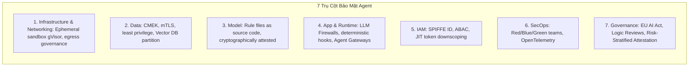
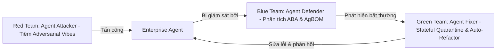
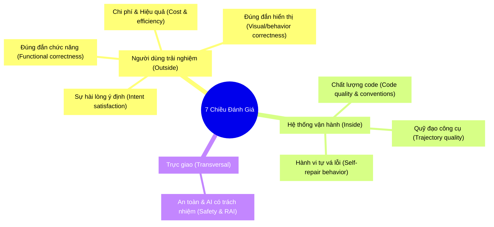

# Bảo Mật & Đánh Giá Agent Vibe Coding (Vibe Coding Agent Security and Evaluation)

Tài liệu này tóm tắt các nội dung kiến thức trọng tâm từ tài liệu nghiên cứu của Google (May 2026): **"Vibe Coding Agent Security and Evaluation"** (tác giả: Sokratis Kartakis, Aron Eidelman, Wafae Bakkali, và Meltem Subasioglu).

---

## Mục lục
1. [Giới thiệu: Định nghĩa lại niềm tin trong kỷ nguyên Agent](#1-giới-thiệu-định-nghĩa-lại-niềm-tin-trong-kỷ-nguyên-agent)
2. [Kiến trúc bảo mật Agent 7 trụ cột (7-Pillar Security Architecture)](#2-kiến-trúc-bảo-mật-agent-7-trụ-cột-7-pillar-security-architecture)
3. [Các mối đe dọa chuỗi cung ứng & Giải pháp phòng thủ](#3-các-mối-đe-dọa-chuỗi-cung-ứng--giải-pháp-phòng-thủ)
4. [Bảo mật logic ứng dụng: IDE vs. CI/CD & MCP Spoofing](#4-bảo-mật-logic-ứng-dụng-ide-vs-cicd--mcp-spoofing)
5. [Định danh, Ủy quyền & Các hành động rủi ro cao (Confused Deputy & Vibe Diff)](#5-định-danh-ủy-quyền--các-hành-động-rủi-ro-cao-confused-deputy--vibe-diff)
6. [Bộ ba SecOps tự trị: Red, Blue, và Green Security Teaming](#6-bộ-ba-secops-tự-trị-red-blue-và-green-security-teaming)
7. [Khả năng quan sát: Giám sát tư duy của Agent (Observability)](#7-khả-năng-quan-sát-giám-sát-tư-duy-của-agent-observability)
8. [Đánh giá Agent Vibe Coding (Evaluation Framework)](#8-đánh-giá-agent-vibe-coding-evaluation-framework)
9. [7 Chiều đánh giá chất lượng (7 Evaluation Dimensions)](#9-7-chiều-đánh-giá-chất-lượng-7-evaluation-dimensions)
10. [Các phương pháp kiểm định & So sánh chuẩn hóa (Standardised Benchmarks)](#10-các-phương-pháp-kiểm-định--so-sánh-chuẩn-hóa-standardised-benchmarks)
11. [Kinh nghiệm thực tiễn để thiết lập bộ Eval cho Vibe Coding](#11-kinh-nghiệm-thực-tiễn-để-thiết-lập-bộ-eval-cho-vibe-coding)
12. [Kết luận](#12-kết-luận)

---

## 1. Giới thiệu: Định nghĩa lại niềm tin trong kỷ nguyên Agent

Lập trình hướng ý định (Intent-driven development) làm tăng tốc độ đổi mới sáng tạo nhưng lại phá vỡ các mô hình tin cậy truyền thống (vốn chỉ mang tính nhị phân: code dịch được, test pass, credential đúng). Một lực lượng lao động tự trị có khả năng tự chạy code sinh ra, tự gọi API nhạy cảm và tự thay đổi môi trường sản xuất.

Do đó, doanh nghiệp cần định nghĩa lại niềm tin (trust) thông qua 2 trục:
*   **Bảo mật (Security):** Agent có chạy trong ranh giới an toàn và không mang ý đồ độc hại không?
*   **Đánh giá (Evaluation):** Những gì xảy ra trong ranh giới đó có xứng đáng để đưa lên môi trường sản xuất không?

> [!NOTE]
> **Khái niệm Effective Trust (Niềm tin hiệu dụng):** Niềm tin không còn là một cổng duyệt một lần lúc deploy nữa; nó phải được tích lũy, xác minh liên tục dựa trên ngữ cảnh thực thi ở runtime thông qua chuỗi cung ứng, định danh, hành vi runtime và liên kết ngữ cảnh của Agent.

---

## 2. Kiến trúc bảo mật Agent 7 trụ cột (7-Pillar Security Architecture)

Bởi vì lỗi của Agent thường bắt nguồn từ Harness (thiếu công cụ, rào chắn lỏng lẻo, luật mơ hồ), bảo mật không thể chỉ nằm bên trong bản thân AI. Hệ thống bắt buộc phải áp dụng kiến trúc **Context-as-a-Perimeter (Bối cảnh làm ranh giới bảo mật)** bao quanh mô hình qua 7 trụ cột:

1.  **Infrastructure & Networking (Hạ tầng & Mạng):** Cô lập luồng chạy trong các sandbox ngắn hạn cấp kernel (như `gVisor`). Quản trị dữ liệu đi ra (egress) qua cache offline hoặc proxy nội bộ để chống thất thoát dữ liệu.
2.  **Data (Dữ liệu):** Bảo mật dữ liệu tĩnh bằng CMEK, dữ liệu truyền tải bằng mTLS. Chia tách dữ liệu khách hàng (tenant partitioning) trong cơ sở dữ liệu Vector để chống **Cross-Tenant Vector Poisoning** (nhiễm độc chéo dữ liệu vector).
3.  **Model (Mô hình):** Bảo vệ logic mô hình trước tấn công ngữ nghĩa (semantic attacks). Coi các file chỉ dẫn như `AGENTS.md` là mã nguồn nhạy cảm cần được ký mã hóa bảo vệ.
4.  **Application & Runtime (Ứng dụng & Luồng chạy):** Thiết lập tường lửa LLM (LLM Firewalls) để lọc prompt/response động. Viết các điểm móc chặn xác thực (hooks) trước khi gọi công cụ hoặc sau khi sửa file.
5.  **IAM (Định danh & Quyền truy cập):** Cấp SPIFFE ID định danh riêng cho từng Agent để tránh lỗi **Confused Deputy** (Người ủy quyền bị nhầm lẫn). Áp dụng phân quyền ABAC và JIT (Just-In-Time) token downscoping (thu hẹp quyền tức thời theo Intent $\times$ User $\times$ Time).
6.  **Observability & SecOps (Khả năng giám sát & Vận hành bảo mật):** Chống lỗi "phản hồi vô hạn" (infinite loops) làm cạn kiệt tài khoản ví doanh nghiệp (**Denial of Wallet - DoW**). Deploy bộ ba SecOps: Blue Team (phân tích hành vi), Red Team (tấn công giả lập), và Green Team (cách ly và tự vá lỗi).
7.  **Governance (Quản trị):** Tuân thủ Đạo luật AI của EU (EU AI Act). Thay thế nút Approve đơn giản bằng quy trình kiểm duyệt logic (Logic Reviews) dịch cú pháp code phức tạp về ngôn ngữ tự nhiên cho con người đọc trước khi duyệt.

---

## 3. Các mối đe dọa chuỗi cung ứng & Giải pháp phòng thủ

### Nạp gói thư viện ảo giác (Slopsquatting)
*   *Mối đe dọa:* LLM thường xuyên bị ảo giác tự bịa ra tên các gói thư viện không tồn tại. Kẻ tấn công sẽ chủ động đăng ký các tên gói ảo giác này trên các kho thư viện mở và tải lên mã độc. Khi Agent tự động sửa đổi file cấu hình và cài đặt dependencies mà không có sự kiểm duyệt của con người, nó sẽ trực tiếp kéo mã độc về máy chủ.
*   *Giải pháp:* Ép buộc Agent chỉ tải thư viện từ các kho lưu trữ nội bộ được kiểm duyệt; ghim chặt phiên bản bằng mã hóa hash. Tự động kiểm tra danh mục SBOM và chữ ký số trong pipeline CI/CD bằng cơ chế Binary Authorisation trước khi phát hành.

### Giới hạn kết nối mạng phi tương tác (Non-Interactive Internet Access)
*   Để chống các cuộc tấn công gián tiếp (Indirect Prompt Injection) ẩn trong mã nguồn HTML của các trang web bên ngoài, Agent chỉ được phép lấy thông tin qua cache offline hoặc thông qua các proxy cào web được làm sạch dữ liệu trước (pre-sanitised crawling services).

---

## 4. Bảo mật logic ứng dụng: IDE vs. CI/CD & MCP Spoofing

### Hai lỗi bảo mật phổ biến của code do AI sinh:
1.  **Quá tin tưởng Client:** Đưa trực tiếp các hoạt động nhạy cảm (như API keys, kiểm tra password, session flags) lên phía Frontend/Browser thay vì xử lý qua Backend bảo mật.
2.  **Bỏ quên lớp phòng thủ Backend:** Sinh mã kết nối DB nhanh nhưng bỏ quên các quy tắc bảo mật dòng dữ liệu (Row-Level Security - RLS).

### Chiến lược Shifting Left (Dịch chuyển bảo mật sang trái):
*   *Tránh:* Việc chặn thô các prompt không an toàn trong IDE của lập trình viên vì gây ức chế và dễ bị lách qua.
*   *Giải pháp:* Dùng các **Developer Advisory Linters** hiển thị cảnh báo gợi ý thời gian thực trong IDE. Đẩy các chốt chặn cứng (SAST như Snyk/Semgrep, SCA, quét secrets) vào pipeline CI/CD tự động trước khi merge code.

### Giả mạo máy chủ công cụ (MCP Spoofing)
*   *Mối đe dọa:* Một MCP server giả mạo hoặc bị chiếm quyền có thể giả dạng công cụ hợp lệ để tiêm mã độc vào Agent.
*   *Giải pháp:* Đặt Centralised Agent Gateway làm chốt chặn trung gian để đánh giá quyền hạn ngữ cảnh (Contextual Authorisation) – kiểm tra xem yêu cầu gọi công cụ của Agent có thực sự khớp với ý định ban đầu của nhà phát triển hay không.

---

## 5. Định danh, Ủy quyền & Các hành động rủi ro cao (Confused Deputy & Vibe Diff)

### Lỗi Confused Deputy (Người ủy quyền bị nhầm lẫn)
*   Xảy ra khi một Agent có đặc quyền cao bị đánh lừa bởi một prompt injection (ví dụ: mã độc ẩn trong repo mở) và vô tình thực hiện lệnh phá hoại đại diện cho kẻ tấn công.
*   *Giải pháp:* Agent **không bao giờ được chạy dưới danh nghĩa quyền hạn Ambient (quyền mặc định kế thừa của lập trình viên)**. Nó phải tự xác thực bằng định danh Agent riêng biệt (SPIFFE ID) và nhận token JIT bị bóp nghẹt quyền tối đa chỉ đủ chạy script đó trong thời gian ngắn ngủi.

### Phê duyệt hành động rủi ro cao bằng Vibe Diff & MFA phần cứng
Đối với các hành động nguy hiểm (sửa DB production, chuyển tiền, đổi cấu hình phân quyền):
1.  Bắt buộc lập trình viên phải chạm tay vào khóa USB bảo mật vật lý (Hardware MFA) để xác thực.
2.  Áp dụng **Vibe Diff**: Một nhóm các mô hình độc lập (Evaluator Quorum) sẽ chặn yêu cầu chạy code lại, dịch ngược đoạn mã code phức tạp đó thành một bản tóm tắt tiếng Anh đơn giản mô tả Agent sắp làm gì để nhà phát triển thực sự hiểu trước khi nhấn duyệt (chống hội chứng lười đọc - confirmation fatigue).

---

## 6. Bộ ba SecOps tự trị: Red, Blue, và Green Security Teaming

Bảo mật thủ công truyền thống không thể theo kịp tốc độ của môi trường phát sinh mã nguồn liên tục bằng AI. Do đó, quy trình SecOps phải được tự động hóa bằng các Agent chuyên trách:

*   **Red Team (Agent Attacker - Kẻ tấn công):** Tự động tạo ra các prompt tấn công giả lập (jailbreaks), tiêm mã độc vào bối cảnh RAG để kiểm tra xem Agent doanh nghiệp có bị mất tập trung hoặc sinh mã nguồn lỗi hay không.
*   **Blue Team (Agent Defender - Kẻ phòng thủ):** Theo dõi danh mục thiết bị thời gian thực (**AgBOM - Runtime Agent Bill of Materials**) ghi nhận mọi cuộc gọi công cụ, model, và luồng dữ liệu ở cấp độ mili-giây. ABA (Agent Behavioural Analytics) sẽ lập tức phát hiện nếu Agent đi chệch hướng hoặc rơi vào vòng lặp vô hạn.
*   **Green Team (Agent Fixer - Kẻ sửa lỗi):** Khi Blue Team phát hiện bất thường, Green Team không giết container (tránh làm hỏng trạng thái các API liên kết) mà thực hiện **Stateful Quarantine (Cách ly bảo toàn trạng thái)**: đóng băng quyền tương tác ngoài nhưng giữ nguyên bộ nhớ của Agent để phân tích. Sau đó, nó tự động viết code sửa lỗi (**Auto-Refactoring**) và đẩy phương án an toàn vào IDE cho lập trình viên.

---

## 7. Khả năng quan sát: Giám sát tư duy của Agent (Observability)

Không thể bảo mật những gì bạn không nhìn thấy. Khả năng quan sát là điều kiện tiên quyết để đánh giá Agent (Glass Box evaluation).
*   **Vibe Trajectory (Quỹ đạo ý chí):** Sử dụng OpenTelemetry để ghi nhận chi tiết: `agent.session` (thời lượng tác vụ), `agent.think` (luồng suy nghĩ, prompt nội bộ trước khi hành động) và `agent.tool` (lệnh gọi công cụ và độ trễ).
*   **Dynamic Tail-Based Sampling:** Chỉ lọc lưu trữ các trace chứa lỗi hoặc có số lượng vòng lặp tự sửa (self-repair loops) vượt ngưỡng quy định để tối ưu hóa chi phí lưu trữ log.

---

## 8. Đánh giá Agent Vibe Coding (Evaluation Framework)

Đánh giá một Vibe Coding Agent hoàn toàn khác với phần mềm truyền thống hay chatbot chăm sóc khách hàng vì 3 đặc điểm:
1.  **Khoảng cách thiếu đặc tả (The Underspecification Gap):** Không có tài liệu đặc tả (spec) cứng từ đầu. Prompt của người dùng thường mơ hồ ("Làm cho dashboard chạy nhanh hơn"). Nhiệm vụ của bộ đánh giá là kiểm chứng xem Agent có tự lấp đầy khoảng trống này một cách chính xác hay không.
2.  **Người dùng không thể tự xác minh:** Người dùng không thể đọc hàng trăm dòng code thời gian thực để biết nó có chạy đúng logic backend hay không.
3.  **Phiên làm việc có trạng thái và lặp lại (Iterative & Stateful):** Mỗi lượt hội thoại (turn) thay đổi trực tiếp file hệ thống thật. Các lỗi nhỏ ban đầu sẽ tích tụ và phóng đại ở các lượt sau.

---

## 9. 7 Chiều đánh giá chất lượng (7 Evaluation Dimensions)

### Chi tiết các chiều đánh giá (Figure 3):
1.  **Intent satisfaction (Độ thỏa mãn ý định):** Chiều đánh giá khó nhất. Agent có xây dựng đúng những gì người dùng *ngầm ý muốn* hay không, chứ không chỉ là những gì họ nói ra trong prompt.
2.  **Functional correctness (Độ chính xác chức năng):** Mã nguồn có build được, chạy được và vượt qua các bài unit test hay không (đây chỉ là mức sàn, không phải mức trần).
3.  **Visual & behavioural correctness (Độ chính xác giao diện & hành vi):** Đối với Agent xây dựng UI, bộ đánh giá phải nhìn vào screenshot thực tế để phát hiện lỗi vỡ layout, độ tương phản thấp hoặc nút bấm bị liệt.
4.  **Cost & efficiency (Chi phí & Hiệu quả):** Số lượng token tiêu thụ, thời gian phản hồi, số lượt chỉnh sửa (iteration count) trước khi ra kết quả đúng.
5.  **Code quality & convention matching (Chất lượng code & Quy ước):** Mã nguồn có viết theo đúng idiom, convention và style của dự án cũ không.
6.  **Trajectory quality (Chất lượng quỹ đạo):** Agent có đi theo lộ trình suy luận và gọi công cụ hợp lý hay không (ví dụ: đọc file liên quan trước khi sửa).
7.  **Self-repair behaviour (Hành vi tự sửa lỗi):** Khi build lỗi hoặc test vỡ, Agent tự hồi phục sửa sai hay làm lỗi trầm trọng thêm qua các lượt hội thoại sau.

---

## 10. Các phương pháp kiểm định & So sánh chuẩn hóa (Standardised Benchmarks)

### Bảng đối chiếu Phương pháp kiểm định vs. Chiều đánh giá (Figure 4):
*   **Standardised benchmarks (SWE-bench, Vibe Code Bench):** Đánh giá tối ưu cho chiều (1), (2), (3).
*   **Automated functional testing (pytest, jest, eslint):** Đánh giá cho chiều (2), (5).
*   **Security & safety evaluation (Snyk, Semgrep):** Đánh giá cho khía cạnh An toàn (RAI).
*   **LLM-as-judge / Agent-as-judge:** Đánh giá tối ưu cho chiều (1), (5), (6).
*   **Browser-based testing (Playwright):** Đánh giá cho chiều (3).
*   **Trajectory inspection (OpenTelemetry):** Đánh giá cho chiều (6), (7).
*   **Human review (Kỹ sư senior kiểm tra):** Đánh giá cho chiều (1), (5), và An toàn (RAI).
*   **Online evaluation (Giám sát 1% traffic thật):** Đánh giá bao phủ toàn bộ các chiều.

### Đánh giá tự động không cần thiết lập qua Kaggle Agent Exams (SAE)
*   **SAE** đại diện cho bước chuyển mình lớn sang đánh giá tự trị bằng cách cho phép Agent tự đăng ký tài khoản thi với Kaggle qua file `SKILL.md` mỏng nhẹ, tự lấy đề bài, tự giải quyết trong môi trường sandbox của mình và tự đẩy điểm số lên bảng xếp hạng trực tiếp.
*   *Lưu ý tránh Overfitting:* Điểm số SWE-bench hay SAE cao chỉ chứng minh năng lực tư duy lập trình của Agent, không đảm bảo Agent đó có mắt thẩm mỹ và phán đoán tốt khi tương tác viết ứng dụng thực tế cho khách hàng.

---

## 11. Kinh nghiệm thực tiễn để thiết lập bộ Eval cho Vibe Coding

*   **Lấy tin nhắn đầu làm thước đo đặc tả (Session Prefix as Rubric):** Vibe coding không có đặc tả sẵn. Giải pháp thực tế là dùng một mô hình mạnh (như `Gemini-3-pro`) đọc 1 hoặc 2 tin nhắn đầu tiên của phiên làm việc để tự động sinh ra **3-5 tiêu chí nghiệm thu (acceptance criteria)** dạng JSON. Sau đó, chấm điểm tất cả các lượt chạy sau dựa trên bộ tiêu chí này (Snippet 1).
*   **Đánh giá hình ảnh hiển thị thực tế, không đọc code:** Đối với các tác vụ UI, hãy dùng một mô hình đa phương thức (multimodal model) xem screenshot thực tế của trang web để chấm điểm layout, styling bên cạnh việc dùng Playwright để test tính tương tác (Snippet 2).
*   **Đánh giá độ hội tụ của phiên (Session Convergence):** Đừng chỉ đánh giá độ chính xác của từng lượt đơn lẻ. Hãy đánh giá xem cả phiên làm việc có hội tụ được về kết quả mong muốn hay không. Xem xét các phiên bị người dùng bỏ dở giữa chừng (abandoned sessions) để phân tích lỗi hệ thống.
*   **Khai thác lịch sử sửa sai của người dùng:** Mỗi câu lệnh "không, không phải thế này" của người dùng chính là dữ liệu dán nhãn lỗi thực tế (labeled failure data). Gom cụm (clustering) các tin nhắn này bằng thuật toán K-Means để phát hiện ra các khoảng trống kiến thức hệ thống cần bổ sung (Snippet 4).

---

## 12. Kết luận

Cú pháp lập trình (Code Generation) đã được AI giải quyết. Kỹ nghệ thực sự của lập trình viên trong tương lai là **Khả năng xác minh (Verification), Kiến trúc bảo mật (Security Harness) và Phán đoán thiết kế (Architectural Judgment)**. 

Bằng cách kết hợp **Kiến trúc bảo mật 7 trụ cột** (sandboxing, JIT downscoping, SecOps tự trị) với **Khung đánh giá chất lượng toàn diện** (7 chiều đánh giá, mô hình LLM-as-judge, đánh giá hình ảnh thực tế), doanh nghiệp có thể tự tin vận hành lực lượng lao động Agent tự trị một cách an toàn và mang lại giá trị thực tế cao.
