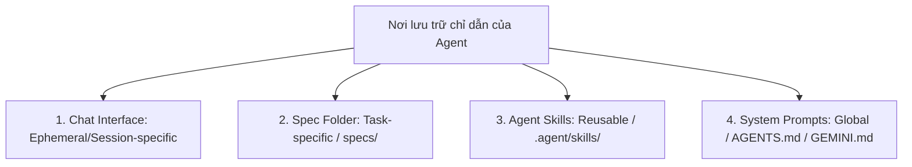
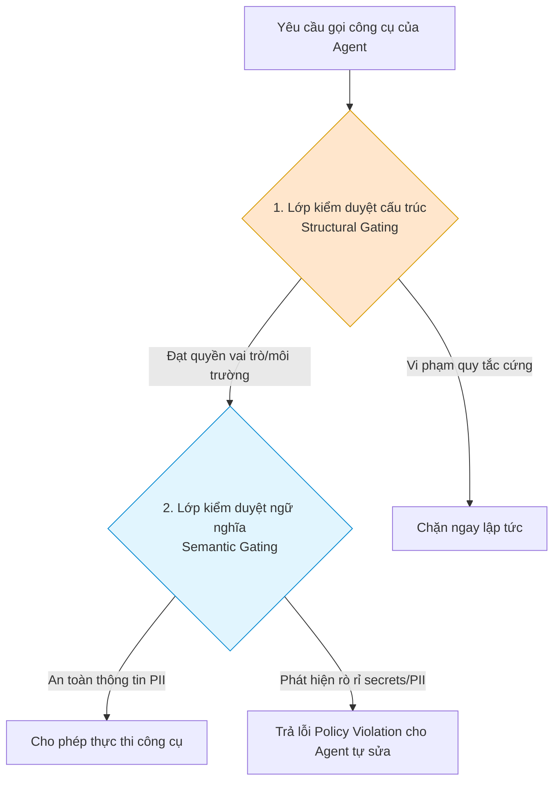

# Phát Triển Hướng Đặc Tả Trong Kỷ Nguyên Vibe Coding (Spec-Driven Production Grade Development)

Tài liệu này tóm tắt các nội dung kiến thức trọng tâm từ tài liệu nghiên cứu của Google (May 2026): **"Spec-Driven Production Grade Development in the Age of Vibe Coding"** (tác giả: Lee Boonstra).

---

## Mục lục
1. [Giới thiệu: Vibe Coding không phải là mang Vibe lên Production](#1-giới-thiệu-vibe-coding-không-phải-là-mang-vibe-lên-production)
2. [Phát triển hướng đặc tả (Spec-Driven Development - SDD)](#2-phát-triển-hướng-đặc-tả-spec-driven-development---sdd)
3. [Nơi lưu trữ các tệp chỉ dẫn của Agent](#3-nơi-lưu-trữ-các-tệp-chỉ-dẫn-của-agent)
4. [Các chế độ Prompting cho từng tình huống cụ thể (Execution Modes)](#4-các-chế-độ-prompting-cho-từng-tình-huống-cụ-thể-execution-modes)
5. [Tương thích công cụ qua MCP (Model Context Protocol)](#5-tương-thích-công-cụ-qua-mcp-model-context-protocol)
6. [Sự tiến hóa của Quy trình & Văn hóa Đội nhóm (Team Culture)](#6-sự-tiến-hóa-của-quy-trình--văn-hóa-đội-nhóm-team-culture)
7. [Bảo mật Zero-Trust trong Phát triển phần mềm hướng Agent](#7-bảo-mật-zero-trust-trong-phát-triển-phềm-mềm-hướng-agent)
8. [Mô hình máy chủ chính sách lai (Hybrid Policy Server)](#8-mô-hình-máy-chủ-chính-sách-lai-hybrid-policy-server)
9. [Cơ chế làm sạch ngữ cảnh (Context Hygiene & ContextResolver)](#9-cơ-chế-làm-sạch-ngữ-cảnh-context-hygiene--contextresolver)
10. [Kết luận](#10-kết-luận)

---

## 1. Giới thiệu: Vibe Coding không phải là mang Vibe lên Production

Tốc độ phát triển mã nguồn của AI đang đạt mức cực đại (warp speed) nhờ các Coding Agent như *Antigravity* hay *Gemini CLI*. Lập trình viên có thể tạo ra hàng ngàn dòng code chỉ trong một buổi sáng. Tuy nhiên, tốc độ này tạo ra **Ảo tưởng về tốc độ (Illusion of Speed)**:
*   Tỷ lệ bug trên mỗi dòng code tăng vọt; AI viết code nhanh hơn nhưng cũng tạo lỗi sai với tần suất chưa từng có.
*   Điểm nghẽn (bottleneck) của quy trình phát triển dịch chuyển từ khâu viết code (code production) sang khâu **tích hợp và đánh giá chất lượng (integration & review)** do con người đảm nhận.
*   **Vibe Coding** (lập trình dựa trên cảm hứng sơ khởi) chỉ phù hợp cho giai đoạn làm prototype. Khi đưa lên sản phẩm thương mại (Production), mọi hành động của Agent phải được định hướng rõ ràng và kiểm soát chặt chẽ thông qua các đặc tả kỹ thuật chuẩn.

> [!NOTE]
> **Khái niệm Agentic AI:** Trong doanh nghiệp, Vibe Coding được chuẩn hóa thành "Phát triển với Agentic AI". Khác với Generative AI thông thường (chỉ là bộ tự động điền từ thông minh - smart autocomplete), Agentic AI đóng vai trò như một **thành viên lai trong đội nhóm (Hybrid Team Member)**, sử dụng LLM làm bộ não tư duy và các công cụ (tools) làm tay chân hành động để tự chạy test, duyệt UI, viết spec và merge code.

---

## 2. Phát triển hướng đặc tả (Spec-Driven Development - SDD)

Trong thế giới kỹ nghệ phần mềm truyền thống, lập trình viên thường tư duy theo kiểu "Viết code trước" (Code-First) – mở IDE và gõ phím cho đến khi chương trình chạy được. Trong kỷ nguyên AI, mô hình này dịch chuyển sang **Đặc tả trước (Spec-Driven)**.

*   Lập trình viên chuyển vai trò thành **Kiến trúc sư kỹ thuật (Technical Architect)**, tập trung viết các bộ đặc tả kỹ thuật chất lượng cao (Technical Specs) để định hướng chính xác cho Agent xây dựng.
*   **Mã nguồn trở nên dùng một lần (Code is disposable):** Nếu bạn có một bộ đặc tả kỹ thuật cực kỳ vững chắc và chuẩn xác, bạn có thể tái tạo (regenerate) toàn bộ codebase nhiều lần. Agent thậm chí có thể chuyển đổi toàn bộ dự án từ Python sang JavaScript chỉ trong một buổi chiều. Con người không còn sự ràng buộc cảm xúc với code cũ do không phải mất hàng giờ gỡ lỗi từng dấu chấm phẩy.
*   **Định dạng Đặc tả tối ưu cho Gemini:** Nghiên cứu năm 2026 về trình biên dịch kỹ năng (*SkCC*) chỉ ra rằng viết chỉ dẫn bằng Markdown thông thường không tối ưu có thể làm giảm 40% hiệu năng của Agent. 
    *   *Định dạng lai tốt nhất:* Kết hợp giữa **Markdown tiêu đề (Narrative Markdown)** và **YAML có điều kiện (Conditional YAML)**.
    *   Gemini sử dụng tiêu đề Markdown sạch để tập trung chú ý, nhưng đạt hiệu năng cao nhất khi đọc cấu trúc dữ liệu, cấu hình phức tạp hoặc API schema (độ sâu lồng nhau > 3) bằng định dạng YAML (độ chính xác phân tích cú pháp của YAML đạt **51.9%**, so với **43.1%** của JSON và **33.8%** của XML). Việc này giúp tối ưu hóa chi phí token và tốc độ phản hồi của mô hình.
*   **Behavior-Driven Development (BDD):** Sử dụng cú pháp tiêu chuẩn **Gherkin** (với các cấu trúc: *Scenario / Given / When / Then*) để ép buộc LLM tư duy theo mô hình: **State (Trạng thái) $\rightarrow$ Action (Hành động) $\rightarrow$ Outcome (Kết quả)**, loại bỏ hoàn toàn việc đoán mò của Agent.

---

## 3. Nơi lưu trữ các tệp chỉ dẫn của Agent

Để thực hành SDD hiệu quả, lập trình viên cần phân bổ tài liệu chỉ dẫn của Agent vào đúng nơi để tránh gây nhiễu ngữ cảnh hoạt động:

1.  **Chat Interface (Giao diện Chat):** Ngắn hạn, theo từng phiên làm việc. Chỉ dùng để ra lệnh điều phối cấp cao hoặc nhận phản hồi nhanh (ví dụ: *"Đọc đặc tả specs/payment_retry.md và viết test case cho Scenario 3"*).
2.  **Spec Folder (Thư mục Specs):** Cố định, được đẩy vào Git để quản lý phiên bản (ví dụ: `./specs/my_spec.md`). Chứa thiết kế hệ thống, sơ đồ DB, tài liệu BDD Gherkin và YAML schema. Agent sẽ tự động lập chỉ mục thư mục này để viết code.
3.  **Agent Skills (Kỹ năng Agent):** Tái sử dụng được, tập trung vào hành vi (ví dụ: `./.agent/skills/docs-maintenance/SKILL.md`). Dạy Agent các thói quen kỹ thuật lặp lại như tự cập nhật file `CHANGELOG.md` khi phát hiện thay đổi code.
4.  **System Prompts (Prompt hệ thống):** Cấu hình toàn cục định hình phong cách viết code của Agent. Được kế thừa xếp chồng từ thư mục cấu hình toàn cục hệ máy (`~/.gemini/GEMINI.md` hoặc `AGENTS.md`) xuống cấu hình riêng của từng dự án (`./.gemini/GEMINI.md`).

---

## 4. Các chế độ Prompting cho từng tình huống cụ thể (Execution Modes)

Doanh nghiệp không dùng một cách prompt duy nhất để giải quyết mọi bài toán. Quy trình được phân rã thành các chế độ thực thi cụ thể:
*   **Project Generation (Tạo khung dự án - Vai trò Kiến trúc sư):** Tạo dựng bộ khung từ con số không. Yêu cầu Agent **không viết code ngay lập tức (No YOLO Mode)**. Ép buộc Agent đề xuất cấu trúc thư mục và lựa chọn thư viện/tech stack trước để con người duyệt. Luôn yêu cầu Agent đính kèm số phiên bản cụ thể của thư viện để tránh Agent tự đề xuất thư viện lỗi thời do giới hạn kiến thức (knowledge cutoff).
*   **Feature Generation (Tạo tính năng - Vai trò Thợ xây):** Viết tính năng mới trên nền codebase có sẵn. Ép buộc Agent tuân thủ phong cách đặt tên và xử lý lỗi đồng nhất với dự án hiện tại. Lập trình viên bắt buộc phải kiểm duyệt sự thay đổi thông qua sơ đồ **Diff** hiển thị dòng code thêm/bớt trong IDE.
*   **Bug Fixing (Sửa lỗi - Vai trò Chuyên gia pháp y):** Dịch chuyển từ *Symptom Prompting* (mô tả triệu chứng: "Nút bấm bị liệt") sang *Evidence Prompting* (đưa ra chứng cứ kỹ thuật: trích xuất log lỗi từ gcloud, chỉ ra mã lỗi HTTP 403). Luôn yêu cầu Agent viết unit test lỗi hoặc lệnh curl tái tạo lỗi trước khi sửa, và **chỉ được sửa đúng nguyên nhân gốc**, tuyệt đối không được tự ý tiện tay dọn dẹp (cleanup) các phần code không liên quan để tránh làm nhiễu quy trình review. Sử dụng trình duyệt UI sandbox cô lập của *Antigravity* để Agent tự kiểm thử trực quan giao diện.
*   **Documentation Writing (Viết tài liệu - Vai trò Tác giả):** Ép buộc Agent cập nhật file `README.md` hoặc `CHANGELOG.md` song song với viết code. Sử dụng cú pháp *Google Style Docstrings* cho Python hoặc *JSDoc* cho TypeScript để Agent dễ đọc hiểu cấu trúc hàm.
*   **Data Engineering (Kỹ nghệ dữ liệu - Vai trò Thủ thư):** Sử dụng các tiện ích mở rộng truy cập dữ liệu đám mây trực tiếp từ IDE. Yêu cầu Agent luôn hiển thị câu lệnh SQL hoặc shell cụ thể dùng để truy vấn dữ liệu trước khi xuất kết quả.

---

## 5. Tương thích công cụ qua MCP (Model Context Protocol)

MCP giải quyết bài toán tương thích công cụ cho mọi framework. MCP được coi là **"Cổng USB-C cho các công cụ AI"**. Lập trình viên chỉ cần xây dựng một MCP Server (ví dụ: công cụ truy vấn cơ sở dữ liệu SQLite trong khoảng 40 dòng code Python), và bất kỳ Agent tương thích MCP nào cũng có thể gọi và sử dụng công cụ đó mà không cần viết lại mã nguồn tích hợp (tài liệu chi tiết trong file Day 2).

---

## 6. Sự tiến hóa của Quy trình & Văn hóa Đội nhóm (Team Culture)

Việc áp dụng công cụ AI siêu tốc vào một quy trình làm việc cũ kỹ (như gắn động cơ phản lực lên xe ngựa kéo) sẽ gây ra sự sụp đổ hệ thống. Để quản lý lượng commit và Pull Request (PR) khổng lồ do AI tạo ra mà không làm lập trình viên bị quá tải (burnout), doanh nghiệp cần thay đổi văn hóa:
*   **Bundled Summaries & Risk Assessments (Tóm tắt rủi ro đóng gói):** Yêu cầu mọi PR do AI tạo ra bắt buộc phải đính kèm một file Markdown tóm tắt tự động các thay đổi, các điểm nhạy cảm có nguy cơ gãy luồng và đánh giá rủi ro. Giúp con người tập trung đánh giá kiến trúc thay vì soi từng dòng code.
*   **Reimagined Ownership (Định nghĩa lại quyền sở hữu):** Con người không dành thời gian soi xét style code (vì style đã do linter tự động hoặc file quy chuẩn `SKILLS.md` ép buộc). Con người tập trung kiểm duyệt độ toàn vẹn của thiết kế kiến trúc.
*   **The "Conditional LGTM" (Duyệt có điều kiện):** Lập trình viên phê duyệt PR ở trạng thái chờ: nếu tất cả các bài test tự động trong pipeline CI/CD chạy qua (màu xanh), code sẽ tự động được merge mà không cần con người nhấn nút lần hai.
*   **No-Blame Culture (Văn hóa không đổ lỗi):** Lập trình viên chạy Agent không phải là người chịu báng khi xảy ra xung đột merge code hoặc phát sinh bug. Lỗi phải được quy trách nhiệm cho sự đứt gãy của quy trình tích hợp hệ thống.
*   **3 Cấp độ Tự động hóa Code Review (The Spectrum):**
    *   *Tier 1 - Managed (Dịch vụ ngoài):* Sử dụng công cụ ăn liền như Gemini Code Assist trên GitHub để tự động nhận xét style, phát hiện bug. Đơn giản nhưng không tùy biến được theo luật riêng của doanh nghiệp.
    *   *Tier 2 - Hybrid (Mô hình lai):* Dùng GitHub Actions kích hoạt Agent CLI (Antigravity CLI) chạy file kỹ năng review tự viết (ví dụ: file `code-check.md` chấm điểm lỗi logic, vòng lặp vô hạn, rò rỉ secrets).
    *   *Tier 3 - Custom (Hệ thống tự trị quy mô lớn):* Xây dựng Agent chạy trên nền tảng cơ sở dữ liệu đồ thị tri thức (**Knowledge Graph** - ví dụ: Spanner Graph) biểu diễn cấu trúc liên kết toàn bộ mã nguồn, tài liệu, ticket. Cho phép Agent chạy truy vấn cấu trúc đồ thị (GQL) kết hợp tìm kiếm ngữ nghĩa (vector search) để phân tích tác động chéo của PR (*"Nếu sửa hàm này thì những API nào ở các service khác bị ảnh hưởng"*).

---

## 7. Bảo mật Zero-Trust trong Phát triển phần mềm hướng Agent

Để bảo vệ hệ thống trước nguy cơ Agent tự động chạy mã nguồn độc hại hoặc bị thao túng qua prompt injection, doanh nghiệp phải xây dựng lưới an toàn:
*   **Sandboxing (Môi trường cách ly):** Bắt buộc chạy mọi lệnh do Agent sinh ra trong các container cách ly có đặc quyền thấp, giới hạn kết nối mạng. Trong Antigravity, kích hoạt tính năng **Terminal Sandboxing** trong phần cài đặt, hoặc thiết lập môi trường Docker với biến `GEMINI_SANDBOX=docker`. Lỗi thực thi sẽ bị chặn đứng ở cấp kernel mà không ảnh hưởng máy chủ vật lý.
*   **Human-in-the-Loop (HITL):** Các hành động thay đổi trạng thái có rủi ro cao (deploy code, sửa DB schema, chuyển tiền) bắt buộc phải cấu hình chốt chặn kiểm duyệt để con người phê duyệt thủ công.
*   **AI Generated Test Coverage (Kiểm thử tự động):** Ép buộc Agent tự viết các test case (unit test lỗi hoặc curl request tái tạo lỗi) để phủ kín các edge cases trước khi Agent được phép tiến hành sửa lỗi.

---

## 8. Mô hình máy chủ chính sách lai (Hybrid Policy Server)

Máy chủ chính sách (Policy Server) hoạt động như chốt chặn trung gian đánh giá và ngăn chặn các hành động của Agent trước khi lệnh được gửi đến hệ thống ngoài. Nó hoạt động trên 2 lớp bảo vệ:

1.  **Structural Gating (Lớp kiểm duyệt cấu trúc - Đèn giao thông):** Kiểm tra nhanh bằng mã code xác định dựa trên file phân quyền `policies.yaml` (ví dụ: kiểm tra quyền vai trò của Agent - user chỉ có quyền viewer thì lập tức chặn cuộc gọi công cụ `send_email`). Không cần gọi đến LLM để tiết kiệm chi phí và tăng tốc độ.
2.  **Semantic Gating (Lớp kiểm duyệt ngữ nghĩa - Trọng tài thông minh):** Sử dụng một LLM độc lập, chuyên biệt (như Gemini) để phân tích ý định và nội dung dữ liệu truyền vào công cụ (ví dụ: người dùng admin có quyền gửi mail, nhưng LLM phát hiện nội dung mail chứa thông tin định danh cá nhân PII chưa được che hoặc API Key nhạy cảm $\rightarrow$ Chặn hành động). Lớp này giúp ngăn chặn các trường hợp rò rỉ thông tin mà lập trình viên không thể viết hết bằng biểu thức chính quy (regex).

---

## 9. Cơ chế làm sạch ngữ cảnh (Context Hygiene & ContextResolver)

Để loại bỏ hoàn toàn **Nguy cơ ảo giác ngữ cảnh (Context Hallucination)** – hiện tượng Agent tự bịa ra thông tin nhạy cảm (email, URL) để lấp đầy các khoảng trống khi thiếu dữ liệu thật, hệ thống áp dụng cơ chế làm sạch:
*   **Mặt nạ hóa PII (PII Masking):** Thay thế dữ liệu nhạy cảm bằng các biến giữ chỗ (placeholders) dạng `[[VARIABLE_NAME]]`.
*   **Dynamic ContextResolver (Bộ giải quyết ngữ cảnh động):** Viết một bộ thư viện middleware sử dụng regex để tự động quét các chuỗi placeholder như `[[COMMENTER_EMAIL]]` hoặc `[[DEFAULT_PRESENTATION_ID]]` trước khi chạy công cụ, tự động thay thế chúng bằng biến môi trường an sau của hệ thống staging tại thời điểm chạy (runtime), đảm bảo Agent không bao giờ nhìn thấy hoặc lưu trữ thông tin PII thật trong context window hay hệ thống prompt (Snippet 6 & 7).

---

## 10. Kết luận

*   **Tốc độ không giải quyết được nút thắt:** AI giúp viết code nhanh hơn, nhưng làm trầm trọng thêm điểm nghẽn tích hợp hệ thống.
*   **SDD là tương lai:** Thành công của các dự án Agent phụ thuộc vào văn hóa làm việc hướng đặc tả kỹ thuật chặt chẽ, thiết lập các rào chắn Zero-Trust (sandboxing, policy server) và thay đổi văn hóa review của đội ngũ con người.
*   **Kỹ nghệ mới:** Viết code thô đã có máy lo. Người kỹ sư phần mềm của tương lai phải nắm giữ kỹ nghệ **kiểm chứng (verification), quản trị bối cảnh (context hygiene) và phán đoán thiết kế hệ thống**.
